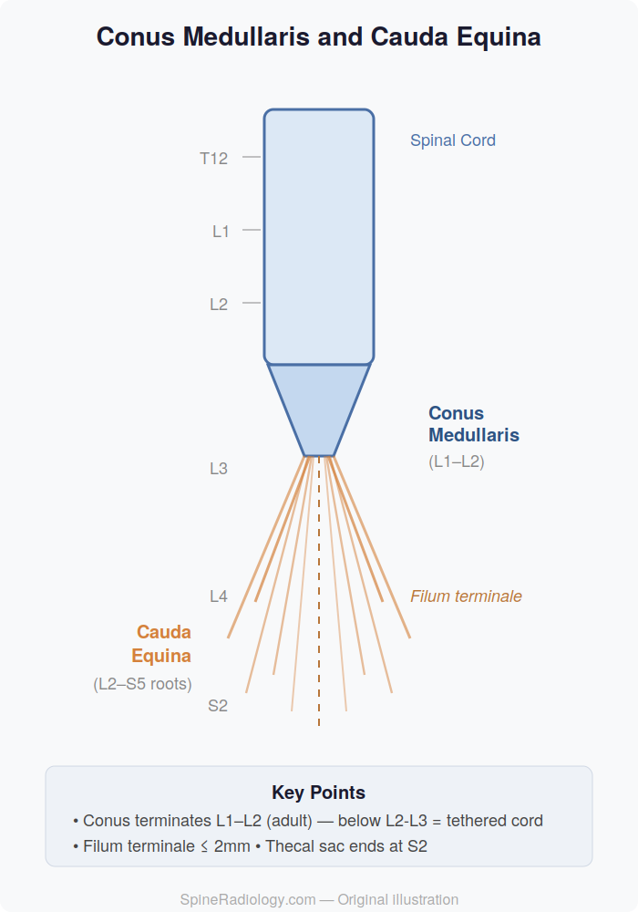

# Conus Medullaris and Cauda Equina

## Definition

The **conus medullaris** is the tapered terminal end of the spinal cord, normally located at the level of **L1–L2** in adults. Below the conus, the **cauda equina** ("horse's tail") is a bundle of lumbar, sacral, and coccygeal nerve roots that descend through the lumbar cistern within the thecal sac before exiting at their respective neural foramina. The **filum terminale** is a thin filament of pia mater extending from the conus tip to the coccyx, anchoring the cord inferiorly.

## Anatomy

### Conus Medullaris

- Cone-shaped termination of the spinal cord
- **Normal position**: L1–L2 level in adults; may be as low as L2–L3 in neonates
- A conus terminating below **L2–L3** in adults or below **L3** in neonates is considered abnormally low and raises concern for **tethered cord**
- Contains the sacral spinal cord segments (S3–S5) and the coccygeal segment
- The epiconus (L4–S1 segments) is located just above the conus

### Cauda Equina

- Composed of the **L2–S5 nerve roots** plus the coccygeal nerve
- Nerve roots are peripheral nerves (lower motor neurons), not central nervous system tissue
- Float freely within the CSF-filled thecal sac (lumbar cistern)
- The thecal sac terminates at approximately **S2**
- Cauda equina nerve roots are more resistant to compression than the spinal cord itself, but acute compression constitutes a **surgical emergency**

### Filum Terminale

| Component | Description |
|-----------|-------------|
| **Filum terminale internum** | Extends from the conus to the end of the thecal sac (S2); composed of pia mater; normally ≤ 2 mm thick |
| **Filum terminale externum (coccygeal ligament)** | Extends from S2 to the coccyx; composed of dura and pia |

<figure markdown="span">
  { width="400" }
  <figcaption>Lower end of the spinal cord showing the conus medullaris, filum terminale, and cauda equina nerve roots. (Gray's Anatomy, public domain)</figcaption>
</figure>

!!! tip "Clinical Pearl"
    A filum terminale thicker than **2 mm** on axial MRI, or a filum that enhances with contrast or contains fat (bright on T1), suggests a **thickened filum** or **fatty filum** — findings associated with tethered cord syndrome even if the conus level is normal. See [Tethered Cord Syndrome](../congenital-developmental/tethered-cord.md).

## Imaging Findings

### MRI

MRI is the definitive modality for evaluating the conus and cauda equina:

| Structure | T1 Signal | T2 Signal | Key Features |
|-----------|-----------|-----------|--------------|
| Normal conus | Intermediate | Intermediate | Smooth taper, terminates at L1–L2 |
| Cauda equina roots | Intermediate | Low (within bright CSF) | Appear as linear filling defects in the thecal sac |
| Filum terminale | Low (thin) | Low (thin) | Should be ≤ 2 mm; no fat or enhancement |
| CSF (lumbar cistern) | Dark | **Bright** | Surrounds and outlines the cauda equina |

**Conus pathology on MRI:**

| Finding | Appearance | Differential |
|---------|-----------|--------------|
| Low-lying conus (below L2–L3) | Cord extends too far caudally | Tethered cord syndrome |
| Conus expansion | Enlarged conus on sagittal/axial | Ependymoma, astrocytoma, conus infarction |
| Conus T2 hyperintensity | High signal within conus | Infarction, myelitis, demyelination, tumor |
| Clumped cauda equina roots | Roots adherent, not floating freely | Arachnoiditis, carcinomatous meningitis |
| Enhancing cauda equina roots | Post-contrast enhancement | Leptomeningeal disease, Guillain-Barré, infection |

### CT Myelography

When MRI is contraindicated, CT myelography demonstrates:

- Conus level and morphology
- Nerve root cutoff or compression
- Intradural filling defects (tumors, disc fragments)

## Clinical Syndromes

### Conus Medullaris Syndrome

- Caused by lesions affecting the conus (typically at T12–L2)
- **Findings**: bilateral, symmetric; early bladder/bowel dysfunction; saddle anesthesia; relatively preserved lower extremity strength; absent bulbocavernosus reflex
- **Common causes**: disc herniation, fracture, tumor, infarction

### Cauda Equina Syndrome

- Caused by compression of the nerve roots below the conus
- **Findings**: asymmetric radiculopathy; progressive leg weakness; late bladder/bowel dysfunction; saddle anesthesia; diminished reflexes
- **Surgical emergency** — requires urgent decompression to prevent permanent neurological deficit

!!! warning "Emergency"
    Cauda equina syndrome with progressive neurological deficit requires **emergent MRI and surgical consultation**. Delay in decompression is associated with permanent bladder, bowel, and sexual dysfunction. See [Cauda Equina Syndrome — Imaging](../special-topics/cauda-equina-syndrome.md).

## Key Points

- The conus medullaris normally terminates at L1–L2; a low conus suggests tethered cord
- The cauda equina consists of L2–S5 nerve roots floating within the lumbar cistern
- The filum terminale should be ≤ 2 mm; thickening or fat content suggests tethered cord
- Conus medullaris syndrome and cauda equina syndrome have distinct clinical presentations
- Cauda equina syndrome is a surgical emergency
- MRI is the imaging standard for both the conus and cauda equina

## Related Articles

- [Spinal Cord](spinal-cord.md)
- [Spinal Nerve Roots and Dermatomes](nerve-roots-dermatomes.md)
- [Sacrum and Coccyx](sacrum-coccyx.md)
- [Tethered Cord Syndrome](../congenital-developmental/tethered-cord.md)
- [Ependymoma](../neoplasms/ependymoma.md)
- [Myxopapillary Ependymoma](../neoplasms/myxopapillary-ependymoma.md)
- [Cauda Equina Syndrome — Imaging](../special-topics/cauda-equina-syndrome.md)
- [Spinal Cord Infarction](../vascular/spinal-cord-infarction.md)
