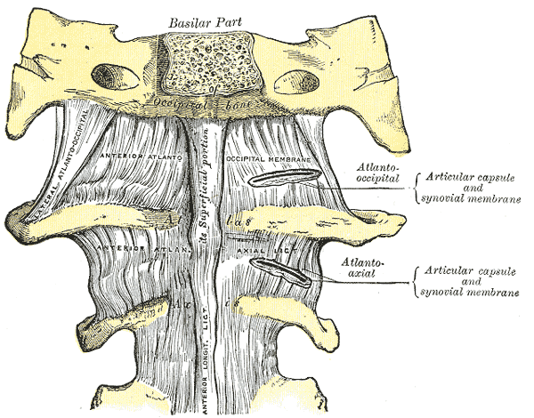
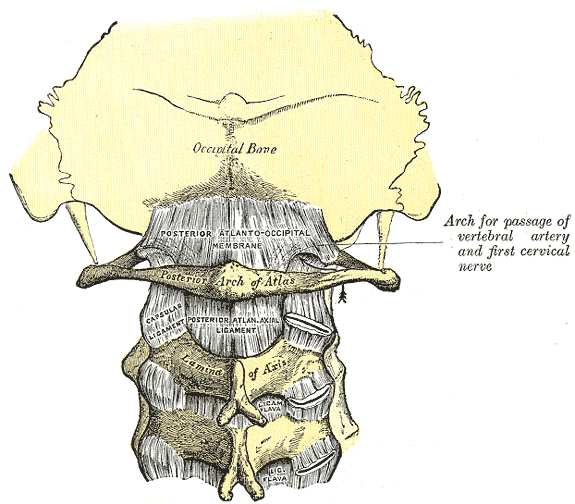

# Craniocervical Junction

## Definition

The craniocervical junction (CCJ), also called the craniovertebral junction (CVJ), is the complex articulation between the base of the skull (occiput) and the upper cervical spine (atlas and axis). It is a unique region where bony stability is sacrificed for mobility, with stability instead provided primarily by ligaments. The CCJ allows approximately 50% of cervical flexion-extension and 50% of cervical rotation.

## Anatomy

### Osseous Structures

- **Occipital condyles** — paired convex bony prominences on the inferior surface of the occiput that articulate with the superior facets of the atlas
- **Atlas (C1)** — a ring-shaped vertebra with no body and no spinous process; lateral masses bear the occipital condyles above and articulate with the axis below
- **Axis (C2)** — characterized by the odontoid process (dens) projecting superiorly from its body; the dens articulates with the anterior arch of the atlas

### Joints

<figure markdown="span">
  { width="450" }
  <figcaption>Anterior view of the atlanto-occipital and atlanto-axial joints showing the articulations between the occiput, atlas, and axis. (Gray's Anatomy, public domain)</figcaption>
</figure>

- **Atlanto-occipital joints** — paired condylar joints between the occipital condyles and the superior articular facets of C1; allow primarily **flexion and extension** ("yes" motion) and some lateral bending
- **Atlanto-axial joints:**
    - **Median atlantoaxial joint** — between the dens of C2 and the anterior arch of C1 (anterior) and the transverse ligament (posterior)
    - **Lateral atlantoaxial joints** — paired joints between the inferior facets of C1 and the superior facets of C2; allow primarily **rotation** ("no" motion)

### Ligaments

<figure markdown="span">
  { width="450" }
  <figcaption>Posterior view of the craniocervical ligaments including the tectorial membrane, cruciate ligament, and alar ligaments. (Gray's Anatomy, public domain)</figcaption>
</figure>

- **Transverse ligament of the atlas** — the most important stabilizer of the atlantoaxial joint; holds the dens against the anterior arch of C1; its disruption results in atlantoaxial instability
- **Alar ligaments** — paired ligaments from the lateral dens to the occipital condyles; limit rotation and lateral bending
- **Tectorial membrane** — continuation of the PLL; attaches to the clivus; a secondary stabilizer
- **Cruciate (cruciform) ligament** — formed by the transverse ligament plus superior and inferior longitudinal bands
- **Apical ligament** — from the tip of the dens to the basion; relatively weak

### Key Measurements

| Measurement | Normal Value | Significance |
|-------------|-------------|-------------|
| **Atlanto-dental interval (ADI)** | ≤3 mm (adults), ≤5 mm (children) | Increased ADI indicates transverse ligament incompetence |
| **Basion-dens interval (BDI)** | ≤12 mm | Abnormal in occipitocervical dissociation |
| **Powers ratio** | <1.0 | >1.0 suggests anterior atlanto-occipital dislocation |

!!! tip "Clinical Pearl"
    The transverse ligament is the critical stabilizer of the CCJ. It can be disrupted by trauma (Type I — midsubstance tear, unstable) or avulsed from its bony attachment on the lateral mass (Type II — avulsion, may heal with immobilization). MRI with T2-weighted and STIR sequences is essential to evaluate the transverse ligament when atlantoaxial instability is suspected. An ADI >3 mm in adults is abnormal and suggests transverse ligament insufficiency.

## Imaging Findings

### Radiography

- **Lateral view:** ADI measurement (anterior arch of C1 to the dens); assess alignment of the basion with the dens
- **Open-mouth (odontoid) view:** evaluates odontoid fractures and lateral mass alignment of C1 on C2
- Lateral mass overhang of C1 on C2 >7 mm total (bilateral) suggests a Jefferson (C1 burst) fracture with transverse ligament disruption

### CT

- Gold standard for osseous CCJ evaluation
- Thin-section axial images with sagittal and coronal reformats
- Evaluates fractures of the occipital condyles, C1 ring, and odontoid process
- Anderson and D'Alonzo classification of odontoid fractures: Type I (tip), Type II (base — most common and most unstable), Type III (extends into C2 body)

### MRI

| Finding | Appearance |
|---------|------------|
| **Transverse ligament** | Low-signal band posterior to the dens on axial T1/T2; disruption seen as discontinuity with edema |
| **Alar ligaments** | Low-signal bands from dens to condyles on coronal images |
| **Tectorial membrane** | Low-signal band posterior to the dens on sagittal images, continuous with PLL |
| **Cord compression** | T2 hyperintensity within the cord at the cervicomedullary junction |

!!! note "Key MRI Finding"
    The transverse ligament is best evaluated on **axial T2-weighted images** at the level of the dens. It appears as a thick, low-signal band curving behind the dens. Disruption appears as high-signal discontinuity with surrounding edema. This finding is critical because it determines whether a C1 fracture requires surgical fixation or can be managed with external immobilization.

## Key Points

- The CCJ allows ~50% of cervical flexion-extension (atlanto-occipital) and ~50% of rotation (atlantoaxial)
- The transverse ligament is the primary stabilizer; its disruption causes atlantoaxial instability
- ADI >3 mm in adults indicates transverse ligament incompetence
- Type II odontoid fractures (at the base of the dens) are the most common and most unstable
- CT is the primary modality for fracture evaluation; MRI is essential for ligamentous assessment
- Open-mouth and lateral radiographs remain important screening views

## Related Articles

- [Atlas (C1) and Axis (C2)](atlas-axis.md)
- [Cervical Vertebrae (C1-C7)](cervical-vertebrae.md)
- [Vertebral Artery](vertebral-artery.md)
- [Spinal Ligaments](spinal-ligaments.md)
- [Spinal Cord](spinal-cord.md)
