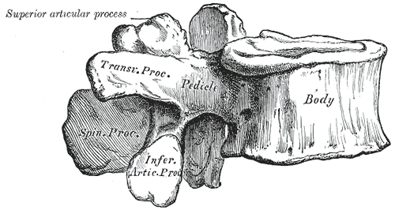

# Facet Joints

## Definition

The facet joints (zygapophyseal joints) are paired synovial joints formed by the articulation of the superior articular process of one vertebra with the inferior articular process of the vertebra above. They are the only true synovial joints of the spine and play a critical role in guiding and limiting spinal motion.

## Anatomy

<figure markdown="span">
  { width="400" }
  <figcaption>Lumbar vertebra (superior view) showing the superior and inferior articular processes that form the facet joints. (Gray's Anatomy, public domain)</figcaption>
</figure>

### Structure

Each facet joint is a true diarthrodial (synovial) joint consisting of:

- **Articular cartilage** — hyaline cartilage covering each facet surface
- **Synovial membrane** — lines the inner surface of the joint capsule; produces synovial fluid
- **Joint capsule** — fibrous capsule reinforced by the capsular ligaments
- **Meniscoid inclusions** — small folds of synovium that project into the joint; can become trapped causing acute pain

### Orientation by Region

The orientation of the facet joints determines the predominant motion at each spinal level:

| Region | Orientation | Primary Motion Allowed |
|--------|-------------|----------------------|
| **Cervical (C3–C7)** | ~45° to the axial plane, facing posterosuperiorly | Flexion, extension, lateral bending, rotation |
| **Thoracic** | ~60° to the axial plane, facing posterolaterally | Rotation; limits flexion/extension |
| **Lumbar** | ~90° to the axial plane (sagittal), facing posteromedially | Flexion/extension; limits rotation |
| **L5–S1** | More coronal than upper lumbar | Transitional — allows some rotation |

### Innervation

- Each facet joint receives **dual innervation** from the medial branches of the dorsal rami at the same level and one level above
- Example: the L4–L5 facet joint is innervated by the medial branches of the L3 and L4 dorsal rami
- This dual innervation is the anatomic basis for **medial branch blocks** and **radiofrequency ablation** as treatments for facet-mediated pain

!!! tip "Clinical Pearl"
    Facet joint orientation explains regional injury patterns. Cervical facets oriented at 45° permit flexion-extension and rotation but are prone to subluxation and perched/locked facets in trauma. Lumbar facets oriented in the sagittal plane resist rotation but are susceptible to degenerative arthropathy from repetitive flexion-extension loading.

## Imaging Findings

### Radiography

- Best seen on **oblique views** — the classic "Scottie dog" appearance in the lumbar spine, where the facet joint forms the neck of the dog
- Facet arthrosis: joint space narrowing, sclerosis, osteophyte formation
- Spondylolysis: a break in the neck of the Scottie dog (pars interarticularis defect)

### CT

- Superior modality for evaluating osseous facet anatomy and arthropathy
- Findings of facet arthropathy: joint space narrowing, subchondral sclerosis, osteophytes, vacuum phenomenon, facet hypertrophy
- Facet cysts (synovial cysts): well-defined, often calcified lesions arising from the joint, may cause lateral recess stenosis
- Facet fractures in trauma: best seen on axial and sagittal reformats

### MRI

| Finding | Appearance |
|---------|------------|
| **Normal facet** | Smooth articular surfaces with thin cartilage, small amount of joint fluid |
| **Facet arthropathy** | Joint effusion, cartilage loss, periarticular edema, osteophytes |
| **Facet cyst (synovial cyst)** | T2-hyperintense, well-defined cyst arising from the joint; may have rim enhancement |
| **Facet edema** | T2/STIR hyperintensity in the articular processes; suggests active inflammation |

!!! note "Key MRI Finding"
    Synovial cysts arising from degenerative facet joints are a common cause of lateral recess stenosis in the lumbar spine. They appear as well-defined, T2-hyperintense lesions immediately adjacent to the facet joint, often with a low-signal rim (hemosiderin or calcification). They typically occur at L4–L5 and may compress the traversing nerve root.

## Key Points

- Facet joints are the only true synovial joints of the spine
- Facet orientation varies by region and determines the predominant motion allowed
- Each joint receives dual innervation from the medial branches of two adjacent dorsal rami
- Facet arthropathy is a major source of axial back pain and can cause spinal stenosis
- Synovial cysts from degenerated facet joints are a common cause of lateral recess stenosis at L4–L5
- CT is best for osseous facet pathology; MRI is best for synovial cysts, effusions, and edema

## Related Articles

- [Spinal Ligaments](spinal-ligaments.md)
- [Lumbar Vertebrae (L1-L5)](lumbar-vertebrae.md)
- [Cervical Vertebrae (C1-C7)](cervical-vertebrae.md)
- [Spinal Canal and Neural Foramina](spinal-canal-neural-foramina.md)
- [Ligamentum Flavum](ligamentum-flavum.md)
