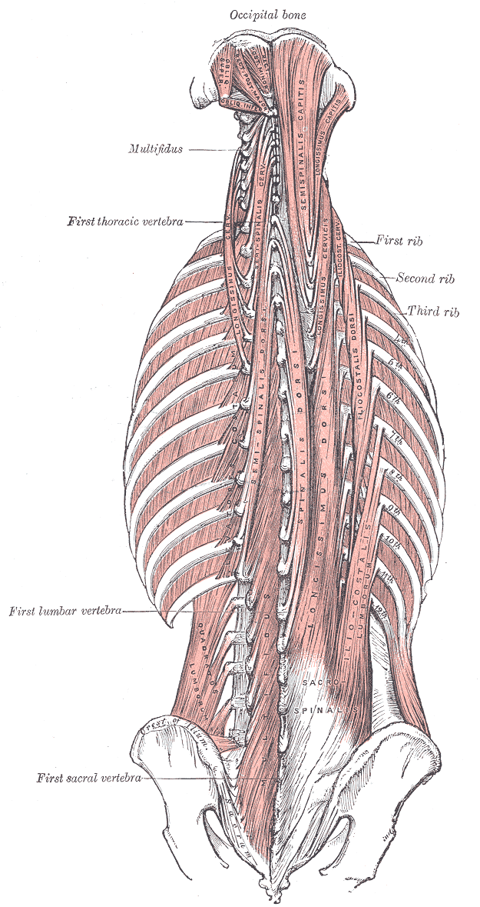

# Paraspinal Musculature

## Definition

The paraspinal muscles are the deep muscles of the back that lie immediately adjacent to the vertebral column. They are responsible for extension, rotation, and lateral bending of the spine, and play a critical role in maintaining posture and spinal stability. On imaging, their size, symmetry, and composition are important markers of spinal health and deconditioning.

## Anatomy

### Posterior Musculature — Erector Spinae Group

<figure markdown="span">
  { width="400" }
  <figcaption>The deep muscles of the back, including the erector spinae and transversospinales groups. (Gray's Anatomy, public domain)</figcaption>
</figure>

The erector spinae (sacrospinalis) is the largest muscle mass of the back, running from the sacrum to the skull in three columns:

- **Iliocostalis** (lateral column) — attaches to the ribs and transverse processes
- **Longissimus** (intermediate column) — the largest; attaches to transverse processes and ribs
- **Spinalis** (medial column) — attaches to spinous processes

**Function:** primary extensors of the spine; also assist with lateral bending

### Deep Segmental Muscles — Transversospinales Group

These muscles lie deep to the erector spinae and span between transverse and spinous processes:

- **Multifidus** — the most important for segmental stabilization; spans 2–4 segments; best developed in the lumbar spine; atrophies rapidly with injury or disuse
- **Rotatores** — span 1–2 segments; best developed in the thoracic spine; assist with rotation
- **Semispinalis** — spans 4–6 segments; most prominent in the cervical and thoracic regions (semispinalis capitis, cervicis, thoracis)

### Psoas Major

- Although not a true paraspinal muscle, the psoas major is routinely evaluated on spinal imaging
- Originates from the anterolateral surface of T12–L5 vertebral bodies and intervertebral discs
- Functions as a hip flexor and lumbar spine stabilizer
- Psoas asymmetry or enlargement may indicate abscess, hemorrhage, or tumor

### Other Relevant Muscles

- **Quadratus lumborum** — lateral to the psoas; assists with lateral bending and stabilization
- **Intertransversarii** — small muscles between adjacent transverse processes
- **Interspinales** — small muscles between adjacent spinous processes

!!! tip "Clinical Pearl"
    **Multifidus atrophy** is one of the earliest and most consistent imaging findings in chronic low back pain. On axial MRI, the multifidus normally appears as a well-defined, symmetric muscle mass medial to the erector spinae at the L4–S1 levels. Atrophy manifests as decreased muscle volume and increased intramuscular fat (fatty infiltration), which appears as increased T1 signal within the muscle. This atrophy can occur rapidly — within days of an acute disc herniation — and may not fully recover even after the primary pathology resolves.

## Imaging Findings

### CT

- Paraspinal muscles are well visualized on CT, particularly on axial images
- **Fatty atrophy:** decreased muscle density (approaches fat density) and decreased cross-sectional area
- **Psoas abscess:** enlarged, low-density psoas with rim enhancement; may contain gas
- **Hemorrhage:** acute hyperdense collection within or adjacent to the muscle

### MRI

| Finding | Appearance |
|---------|------------|
| **Normal muscle** | Intermediate signal on T1; slightly higher signal on T2 |
| **Fatty infiltration** | Increased T1 signal within the muscle replacing normal tissue |
| **Atrophy** | Decreased muscle volume with or without fatty infiltration |
| **Denervation edema (acute)** | T2/STIR hyperintensity in a specific myotomal distribution |
| **Denervation atrophy (chronic)** | Fatty replacement in a specific myotomal distribution |
| **Abscess** | T2-hyperintense collection with peripheral enhancement |

!!! note "Key MRI Finding"
    **Denervation changes** in the paraspinal muscles follow a myotomal pattern and can help localize the level of nerve root injury. In the acute phase (days to weeks), the affected muscles show edema (T2/STIR hyperintensity). In the chronic phase (months), irreversible fatty infiltration and atrophy develop. The multifidus at a specific level is innervated by the medial branch of the dorsal ramus at the same level, making focal multifidus atrophy a reliable localizing sign.

## Key Points

- The erector spinae group is the primary extensor of the spine; the multifidus provides segmental stabilization
- Multifidus atrophy is an early finding in chronic low back pain and after disc herniation
- Fatty infiltration of paraspinal muscles is assessed on T1-weighted MRI
- Denervation changes follow a myotomal pattern and can localize the level of nerve root pathology
- Psoas pathology (abscess, hemorrhage, tumor) is an important finding on spinal imaging
- Paraspinal muscle assessment should be part of routine spinal MRI interpretation

## References

1. Bogduk N, Wilson AS, Tynan W. The human lumbar dorsal rami. J Anat. 1982;134(Pt 2):383-397. Available from: https://pmc.ncbi.nlm.nih.gov/articles/PMC1167925/
2. Kjaer P, Bendix T, Sorensen JS, Korsholm L, Leboeuf-Yde C. Are MRI-defined fat infiltrations in the multifidus muscles associated with low back pain? BMC Med. 2007;5:2. Available from: https://pubmed.ncbi.nlm.nih.gov/17254322/
3. Woodham M, Woodham A, Skeate JG, Freeman M. Long-term lumbar multifidus muscle atrophy changes documented with magnetic resonance imaging: a case series. J Radiol Case Rep. 2014;8(5):27-34. Available from: https://pubmed.ncbi.nlm.nih.gov/25426227/
4. Faur C, Patrascu JM, Haragus H, Anglitoiu B. Correlation between multifidus fatty atrophy and lumbar disc degeneration in low back pain. BMC Musculoskelet Disord. 2019;20(1):414. Available from: https://pubmed.ncbi.nlm.nih.gov/31488112/
5. Mandelli F, Nüesch C, Zhang Y, Halbeisen F, Schären S, Mündermann A, Netzer C. Assessing fatty infiltration of paraspinal muscles in patients with lumbar spinal stenosis: Goutallier classification and quantitative MRI measurements. Front Neurol. 2021;12:656487. Available from: https://pmc.ncbi.nlm.nih.gov/articles/PMC8446197/
6. Corazzelli G, Meglio V, Corvino S, Leonetti S, Ricciardi F, D'Elia A, Pizzuti V, Santilli M, Innocenzi G. The Goutallier classification system: how does paravertebral adipose degeneration change in patients with symptomatic lumbar spinal stenosis? Spine (Phila Pa 1976). 2024;49(12):E174-E182. Available from: https://pubmed.ncbi.nlm.nih.gov/38258887/

## Related Articles

- [Lumbar Vertebrae (L1-L5)](lumbar-vertebrae.md)
- [Spinal Nerve Roots and Dermatomes](nerve-roots-dermatomes.md)
- [Vertebral Column Overview](vertebral-column-overview.md)
- [Thoracic Vertebrae (T1-T12)](thoracic-vertebrae.md)
