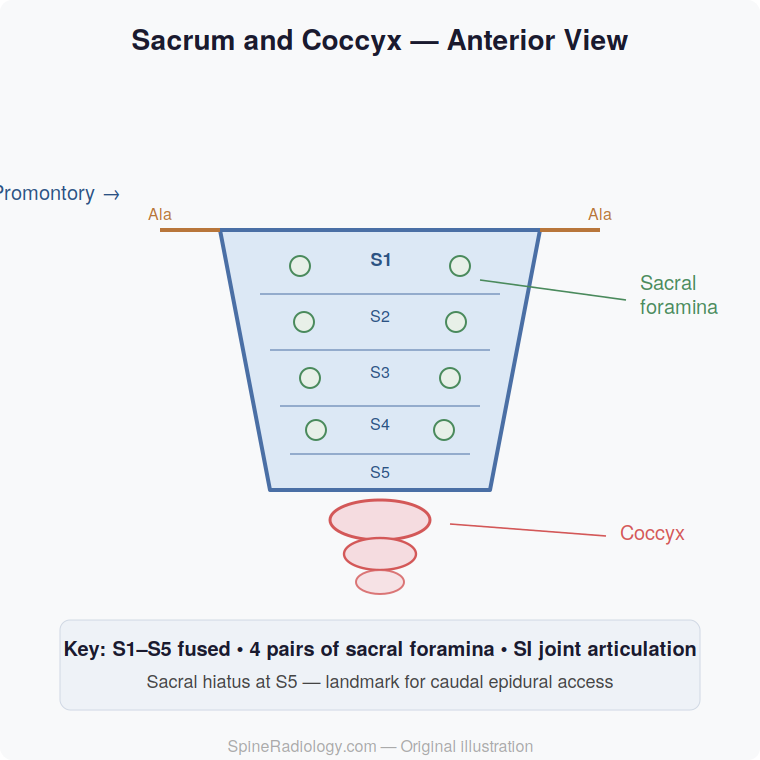

# Sacrum and Coccyx

## Definition

The **sacrum** is a large triangular bone formed by the fusion of **five sacral vertebrae (S1–S5)**, situated between the lumbar spine and the coccyx. It forms the posterior wall of the pelvis and articulates with the iliac bones at the sacroiliac joints. The **coccyx** (tailbone) consists of **3–5 fused rudimentary vertebrae** at the terminal end of the vertebral column.

## Anatomy

### Sacrum

The sacrum is a keystone structure transmitting the weight of the spine to the pelvis:

- **Promontory** — the anterosuperior margin of S1, a key obstetric and surgical landmark
- **Sacral ala (wings)** — lateral expansions of S1 that articulate with the iliac bones
- **Sacral canal** — continuation of the vertebral canal, containing the cauda equina and filum terminale
- **Sacral foramina** — four pairs of anterior and posterior foramina transmitting the sacral nerve roots
- **Sacral hiatus** — the opening at the caudal end of the sacral canal (absent S5 laminae), used for caudal epidural access
- **Sacral cornua** — small bony projections flanking the sacral hiatus

<figure markdown="span">
  { width="400" }
  <figcaption>Sacrum (anterior view), showing the promontory, anterior sacral foramina, and auricular surfaces. (Gray's Anatomy, public domain)</figcaption>
</figure>

### Sacroiliac Joints

The sacroiliac (SI) joints are synovial joints anteriorly and syndesmotic (ligamentous) joints posteriorly:

- Transmit axial load from the spine to the lower extremities
- Surrounded by the strongest ligaments in the body
- Common site of inflammatory sacroiliitis (ankylosing spondylitis)

### Coccyx

- Composed of 3–5 fused segments
- Articulates with the sacrum at the sacrococcygeal joint (often partially fused)
- Serves as an attachment point for pelvic floor muscles and ligaments
- Highly variable in morphology; may be curved anteriorly

!!! tip "Clinical Pearl"
    The **sacral hiatus** is an important landmark for caudal epidural steroid injections. It is identified by palpating the sacral cornua. On imaging, absence of the posterior elements at S5 (and sometimes S4) is a normal finding, not a defect.

## Imaging Findings

### Radiography

- **AP pelvis** — evaluates sacral alignment, SI joints, and sacral fractures
- **Lateral sacrum** — assesses sacral curvature, sacrococcygeal junction, and coccyx
- **Ferguson view** — AP view angled cephalad 30° for dedicated sacral visualization

### CT

CT is the primary modality for evaluating:

- Sacral fractures (especially insufficiency fractures — characteristic "H" pattern)
- Sacroiliac joint pathology
- Sacral tumors (chordoma, giant cell tumor)
- Sacral canal dimensions

### MRI

| Finding | T1 Signal | T2 Signal | Significance |
|---------|-----------|-----------|--------------|
| Normal sacral marrow | Bright (fatty in adults) | Intermediate | Complete fatty conversion by adulthood |
| Sacral insufficiency fracture | Low | High (STIR) | "H" or "Honda sign" pattern on coronal STIR |
| Sacroiliitis (acute) | Low | High | Periarticular bone marrow edema |
| Sacral chordoma | Low–intermediate | **Very high** | Classically T2-bright, midline, destructive |
| Tarlov cyst | Dark (CSF) | **Bright** (CSF) | Perineural cyst, usually incidental |

## Key Points

- The sacrum is formed by fusion of five vertebrae and is the keystone of the pelvic ring
- The sacral canal contains the cauda equina and terminates at the sacral hiatus
- Sacral insufficiency fractures show an "H" pattern on coronal STIR MRI
- The sacroiliac joints are a key site for inflammatory sacroiliitis
- The coccyx is highly variable in morphology and commonly injured by direct trauma

## References

1. Sattar MH, Guthrie ST. Anatomy, Back, Sacral Vertebrae. [Updated 2023 Jul 30]. In: StatPearls [Internet]. Treasure Island (FL): StatPearls Publishing; 2026. Available from: https://www.ncbi.nlm.nih.gov/books/NBK551653/
2. Nastoulis E, Karakasi MV, Pavlidis P, Thomaidis V, Fiska A. Anatomy and clinical significance of sacral variations: a systematic review. Folia Morphol (Warsz). 2019;78(4):651-667. PMID: 30949993.
3. Woon JTK, Perumal V, Maigne JY, Stringer MD. CT morphology and morphometry of the normal adult coccyx. Eur Spine J. 2013;22(4):863-870. doi:10.1007/s00586-012-2595-2. PMID: 23192732; PMCID: PMC3631051.
4. Skalski MR, Matcuk GR, Patel DB, Tomasian A, White EA, Gross JS. Imaging Coccygeal Trauma and Coccydynia. Radiographics. 2020;40(4):1090-1106. doi:10.1148/rg.2020190132. PMID: 32609598.
5. Poilliot AJ, Zwirner J, Doyle T, Hammer N. A Systematic Review of the Normal Sacroiliac Joint Anatomy and Adjacent Tissues for Pain Physicians. Pain Physician. 2019;22(4):E247-E274. PMID: 31337164.
6. Al-Mnayyis A, Obeidat S, Badr A, Jouryyeh B, Azzam S, Al Bibi H, et al. Radiological Insights into Sacroiliitis: A Narrative Review. Clin Pract. 2024;14(1):106-121. doi:10.3390/clinpract14010009. PMID: 38248433; PMCID: PMC10801489.
7. Fujii M, Abe K, Hayashi K, Kosuda S, Yano F, Watanabe S, et al. Honda sign and variants in patients suspected of having a sacral insufficiency fracture. Clin Nucl Med. 2005;30(3):165-169. PMID: 15722819.

## Related Articles

- [Vertebral Column Overview](vertebral-column-overview.md)
- [Lumbar Vertebrae (L1-L5)](lumbar-vertebrae.md)
- [Lumbosacral Junction](lumbosacral-junction.md)
- [Conus Medullaris and Cauda Equina](conus-cauda-equina.md)
- [Sacral Fractures](../trauma/sacral-fractures.md)
- [Ankylosing Spondylitis](../inflammatory-autoimmune/ankylosing-spondylitis.md)
- [Chordoma](../neoplasms/chordoma.md)
- [Tarlov Cysts](../special-topics/tarlov-cysts.md)
