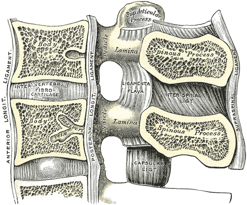

# Spinal Ligaments

## Definition

The spinal ligaments are a series of strong connective tissue bands that stabilize the vertebral column, limit excessive motion, and protect the spinal cord and nerve roots. They connect adjacent vertebrae and span multiple segments, providing both segmental and global stability to the spine.

## Anatomy

<figure markdown="span">
  { width="450" }
  <figcaption>Median sagittal section of two lumbar vertebrae showing the anterior and posterior longitudinal ligaments, ligamentum flavum, and interspinous ligament. (Gray's Anatomy, public domain)</figcaption>
</figure>

The major spinal ligaments can be organized by their relationship to the vertebral canal:

### Anterior Ligaments

- **Anterior longitudinal ligament (ALL)** — a broad, strong band running along the anterior surface of the vertebral bodies from the occiput to the sacrum; resists extension and limits anterior disc herniation
- **Posterior longitudinal ligament (PLL)** — a narrower band along the posterior surface of the vertebral bodies within the spinal canal; resists flexion and limits posterior disc herniation

### Posterior Ligaments

- **Ligamentum flavum** — paired elastic ligaments connecting the laminae of adjacent vertebrae; lines the posterior aspect of the spinal canal
- **Interspinous ligaments** — thin membranes connecting adjacent spinous processes from root to tip
- **Supraspinous ligament** — a strong cord connecting the tips of the spinous processes from C7 to the sacrum; continuous with the nuchal ligament in the cervical region
- **Nuchal ligament** — a triangular fibrous sheet in the cervical region extending from the external occipital protuberance to the C7 spinous process; replaces the supraspinous ligament above C7

### Segmental Ligaments

- **Intertransverse ligaments** — connect adjacent transverse processes; best developed in the lumbar spine
- **Capsular ligaments** — surround and reinforce each facet (zygapophyseal) joint

!!! tip "Clinical Pearl"
    The ligamentum flavum has the highest elastin content of any ligament in the body (~80%), which allows it to stretch during flexion and recoil during extension without buckling into the spinal canal. With aging and degeneration, it loses elasticity and hypertrophies, becoming a major cause of central spinal stenosis.

## Imaging Findings

### Radiography

- Ligaments are not directly visualized on plain radiographs
- Indirect signs of ligamentous injury include widened interspinous distance, vertebral malalignment, and facet joint widening
- Flexion/extension views can demonstrate instability from ligamentous insufficiency

### CT

- Ligaments are poorly visualized on standard CT
- Calcification or ossification of the ALL is seen in **diffuse idiopathic skeletal hyperostosis (DISH)**
- Ossification of the PLL (OPLL) is most common in the cervical spine, particularly in East Asian populations
- CT can demonstrate avulsion fractures at ligament attachment sites

### MRI

MRI is the gold standard for ligamentous evaluation:

| Ligament | Best Sequence | Normal Appearance |
|----------|--------------|-------------------|
| **ALL** | Sagittal T1/T2 | Thin, low-signal band along anterior vertebral bodies |
| **PLL** | Sagittal T1/T2 | Thin, low-signal band along posterior vertebral bodies |
| **Ligamentum flavum** | Sagittal/Axial T1/T2 | Low signal; thickens with hypertrophy |
| **Interspinous/Supraspinous** | Sagittal T2/STIR | Low-signal bands between spinous processes |

!!! note "Key MRI Finding"
    Ligamentous injury appears as discontinuity of the normally low-signal structure, with surrounding high T2/STIR signal indicating edema or hemorrhage. The posterior ligamentous complex (PLC) — comprising the supraspinous ligament, interspinous ligament, ligamentum flavum, and facet capsules — is critical in determining spinal stability after trauma.

## Key Points

- The spinal ligaments provide both segmental and global stability to the vertebral column
- The ALL is the strongest spinal ligament and resists extension
- The ligamentum flavum is the most elastic ligament in the body, but hypertrophies with age causing stenosis
- The posterior ligamentous complex is a key determinant of spinal stability in trauma
- MRI is the best modality for evaluating ligamentous integrity
- DISH and OPLL represent pathologic calcification/ossification of the ALL and PLL, respectively

## Related Articles

- [Anterior Longitudinal Ligament](anterior-longitudinal-ligament.md)
- [Posterior Longitudinal Ligament](posterior-longitudinal-ligament.md)
- [Ligamentum Flavum](ligamentum-flavum.md)
- [Facet Joints](facet-joints.md)
- [Vertebral Column Overview](vertebral-column-overview.md)
- [Spinal Canal and Neural Foramina](spinal-canal-neural-foramina.md)
