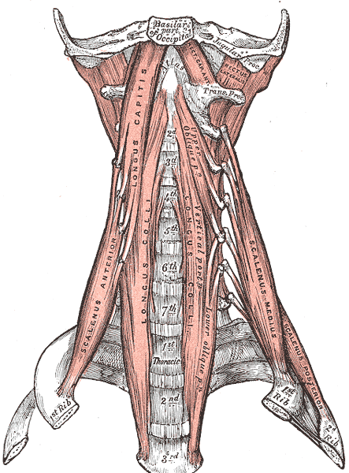

# Vertebral Artery

## Definition

The vertebral arteries are paired vessels that ascend through the transverse foramina of the cervical vertebrae to supply the posterior circulation of the brain and the cervical spinal cord. They are the first and largest branches of the subclavian arteries.

## Anatomy

<figure markdown="span">
  { width="400" }
  <figcaption>The vertebral artery ascending through the transverse foramina of the cervical vertebrae. (Gray's Anatomy, public domain)</figcaption>
</figure>

### Course

The vertebral artery is divided into four segments:

- **V1 (pre-foraminal)** — from its origin at the subclavian artery to the transverse foramen of C6; ascends between the longus colli and anterior scalene muscles
- **V2 (foraminal/transverse)** — ascends through the transverse foramina from C6 to C2; surrounded by a venous plexus and sympathetic nerve fibers
- **V3 (atlantic/extradural)** — exits the C1 transverse foramen, curves posteromedially around the lateral mass of the atlas in a groove on the posterior arch, then pierces the posterior atlanto-occipital membrane to enter the vertebral canal
- **V4 (intradural/intracranial)** — pierces the dura and arachnoid, ascends anterior to the medulla, and joins the contralateral vertebral artery to form the basilar artery at the pontomedullary junction

### Key Anatomic Points

- The vertebral artery typically enters the transverse foramen at **C6**, though variants entering at C5, C4, or C7 occur in ~5–10% of individuals
- The V3 segment is the most mobile and vulnerable to injury during cervical manipulation or surgery
- The vertebral arteries are frequently **asymmetric** — the left is dominant in approximately 50%, the right in 25%, and codominant in 25%
- Branches include the anterior and posterior spinal arteries, posterior inferior cerebellar artery (PICA), and meningeal branches

!!! tip "Clinical Pearl"
    The V3 segment (C1–C2 loop) is particularly vulnerable during **upper cervical spine surgery** and **chiropractic cervical manipulation**. The artery makes a sharp loop at C1 and is relatively fixed, making it susceptible to stretching, dissection, or thrombosis with rotational forces. Vertebral artery dissection is a recognized cause of posterior circulation stroke in young adults, often following neck manipulation or trauma.

## Imaging Findings

### Radiography

- Vertebral arteries are not visible on plain films
- The transverse foramina may be asymmetric, suggesting vertebral artery dominance

### CT

- **CTA (CT Angiography)** is the standard rapid evaluation for vertebral artery pathology
- Demonstrates arterial course, caliber, stenosis, dissection, and anomalous entry level
- Dissection: intimal flap, mural hematoma (crescentic mural thickening), vessel narrowing or occlusion
- Bony CT may show unilateral transverse foramen enlargement in arteriovenous fistulas

### MRI/MRA

| Finding | Appearance |
|---------|------------|
| **Normal flow** | Flow void on T1/T2; bright on MRA time-of-flight (TOF) |
| **Dissection** | Crescentic T1-hyperintense mural hematoma on fat-saturated axial T1; irregular narrowing on MRA |
| **Occlusion** | Loss of flow void; absent signal on MRA |
| **Hypoplasia** | Uniformly small caliber throughout; diameter <2 mm |
| **Fenestration** | Duplication of a segment of the artery; usually an incidental variant |

!!! note "Key MRI Finding"
    The hallmark of vertebral artery dissection on MRI is a **crescentic T1-hyperintense signal** surrounding the narrowed flow void on fat-saturated axial T1-weighted images. This represents methemoglobin within the mural hematoma. MRA shows irregular narrowing, a tapered "flame-shaped" occlusion, or a double-lumen sign.

## Key Points

- The vertebral artery has four segments (V1–V4) and typically enters the transverse foramen at C6
- Vertebral arteries are commonly asymmetric; left dominance is most frequent
- The V3 segment at C1–C2 is most vulnerable to injury during manipulation and surgery
- CTA is the first-line imaging for suspected vertebral artery injury or dissection
- MRI with fat-saturated T1 shows the mural hematoma of dissection as a crescentic bright signal
- Vertebral artery dissection is an important cause of posterior circulation stroke in young adults

## Related Articles

- [Cervical Vertebrae (C1-C7)](cervical-vertebrae.md)
- [Atlas (C1) and Axis (C2)](atlas-axis.md)
- [Spinal Arterial Supply](spinal-arterial-supply.md)
- [Craniocervical Junction](craniocervical-junction.md)
