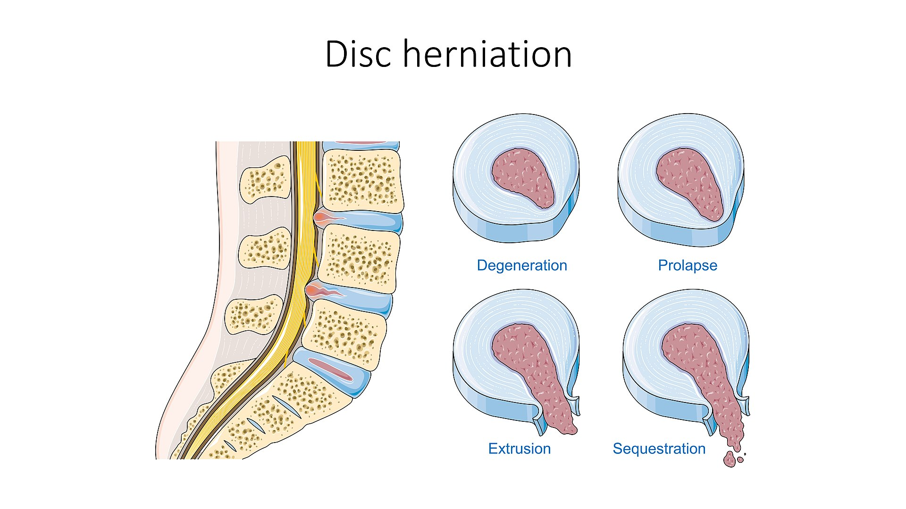

# Disc Bulge vs Herniation

## Definition

The distinction between disc bulge and disc herniation is defined by the extent and pattern of disc material extending beyond the vertebral body margin. This terminology follows the **North American Spine Society (NASS) / American Society of Spine Radiology (ASSR) / American Society of Neuroradiology (ASNR)** joint nomenclature guidelines, which standardize disc pathology reporting.

## Nomenclature

<figure markdown="span">
  { width="550" }
  <figcaption>Stages of disc herniation: degeneration, prolapse, extrusion, and sequestration. (Smart-Servier, CC BY 3.0)</figcaption>
</figure>

### Disc Bulge

- **Definition:** circumferential (>50% of disc circumference) extension of disc tissue beyond the vertebral body margins
- **Mechanism:** generalized expansion of the annulus, often from disc degeneration and height loss
- **NOT a herniation** — there is no focal protrusion of nuclear material through the annulus
- Typically symmetric and uniform around the disc margin
- Very common with aging; often asymptomatic

### Disc Herniation

- **Definition:** localized (<50% of disc circumference) displacement of disc material beyond the vertebral body margin
- Represents focal displacement of nucleus pulposus, annulus fibrosus, or endplate cartilage
- Subtypes based on morphology: **protrusion, extrusion, and sequestration**

### Herniation Subtypes

| Subtype | Definition | Key Feature |
|---------|-----------|-------------|
| **Protrusion** | Base of herniation wider than the extruded portion | Broad-based, contained by outer annular fibers |
| **Extrusion** | Herniated portion wider than the base; extends through a defect in the annulus | "Mushroom" or "teardrop" shape; may extend above or below the disc level |
| **Sequestration** | Free fragment completely separated from the parent disc | Migrated fragment with no continuity to the disc; may be above, below, or posterior |

### Location Descriptors

| Location | Position |
|----------|----------|
| **Central** | Midline, directly posterior |
| **Paracentral (subarticular)** | Just off midline, in the lateral recess |
| **Foraminal** | Within the neural foramen |
| **Far lateral (extraforaminal)** | Beyond the foramen, lateral to the pedicle |

!!! tip "Clinical Pearl"
    The location of a disc herniation determines which nerve root is compressed. In the lumbar spine, a **paracentral herniation** at L4–L5 compresses the **traversing L5 nerve root**, while a **foraminal herniation** at the same level compresses the **exiting L4 nerve root**. This distinction is critical for correlating imaging with clinical symptoms and planning treatment.

## Imaging Findings

### MRI

- **Disc bulge:** smooth, circumferential extension beyond the vertebral margins; same signal as parent disc
- **Protrusion:** focal, broad-based extension; base wider than dome; usually same signal as disc
- **Extrusion:** focal extension with narrower base; may have different signal than parent disc (higher T2 if acutely hydrated)
- **Sequestration:** separate fragment; may have different signal from parent disc; may enhance peripherally with gadolinium

## Key Points

- Bulge = circumferential (>50%); herniation = focal (<50%)
- Herniations are subclassified as protrusion, extrusion, or sequestration
- Location (central, paracentral, foraminal, far lateral) determines which nerve root is affected
- Standardized nomenclature from NASS/ASSR/ASNR should be used in reports
- Disc bulges are common with aging and usually asymptomatic

## References

1. Fardon DF, Williams AL, Dohring EJ, Murtagh FR, Gabriel Rothman SL, Sze GK. Lumbar disc nomenclature: version 2.0: Recommendations of the combined task forces of the North American Spine Society, the American Society of Spine Radiology and the American Society of Neuroradiology. *Spine J.* 2014;14(11):2525-45. doi:10.1016/j.spinee.2014.04.022. PMID: 24768732. [https://pubmed.ncbi.nlm.nih.gov/24768732/](https://pubmed.ncbi.nlm.nih.gov/24768732/)
2. Fardon DF, Milette PC. Nomenclature and classification of lumbar disc pathology. Recommendations of the Combined Task Forces of the North American Spine Society, American Society of Spine Radiology, and American Society of Neuroradiology. *Spine (Phila Pa 1976).* 2001;26(5):E93-E113. doi:10.1097/00007632-200103010-00006. PMID: 11242399. [https://pubmed.ncbi.nlm.nih.gov/11242399/](https://pubmed.ncbi.nlm.nih.gov/11242399/)
3. Williams AL, Murtagh FR, Rothman SLG, Sze GK. Lumbar Disc Nomenclature: Version 2.0. *AJNR Am J Neuroradiol.* 2014;35(11):2029. PMC7965177. [https://pmc.ncbi.nlm.nih.gov/articles/PMC7965177/](https://pmc.ncbi.nlm.nih.gov/articles/PMC7965177/)
4. Smithuis R. Lumbar Disc Nomenclature 2.0. The Radiology Assistant. Published 2017-01-05. [https://radiologyassistant.nl/neuroradiology/spine/lumbar-disc-nomenclature-2-0](https://radiologyassistant.nl/neuroradiology/spine/lumbar-disc-nomenclature-2-0)
5. Smithuis R. Lumbar Disc Herniation (and other causes of nerve compression). The Radiology Assistant. Published 2014-12-14. [https://radiologyassistant.nl/neuroradiology/spine/lumbar-disc-herniation](https://radiologyassistant.nl/neuroradiology/spine/lumbar-disc-herniation)
6. Disc bulge. Radiopaedia. [https://radiopaedia.org/articles/disc-bulge](https://radiopaedia.org/articles/disc-bulge)
7. Konieczny MR, Reinhardt J, Prost M, Schleich C, Krauspe R. Signal Intensity of Lumbar Disc Herniations: Correlation With Age of Herniation for Extrusion, Protrusion, and Sequestration. *Int J Spine Surg.* 2020. PMC7043841. [https://pmc.ncbi.nlm.nih.gov/articles/PMC7043841/](https://pmc.ncbi.nlm.nih.gov/articles/PMC7043841/)

## Related Articles

- [Disc Protrusion](disc-protrusion.md)
- [Disc Extrusion](disc-extrusion.md)
- [Disc Sequestration](disc-sequestration.md)
- [Lumbar Disc Herniation](lumbar-disc-herniation.md)
- [Cervical Disc Herniation](cervical-disc-herniation.md)
- [Intervertebral Disc](../anatomy/intervertebral-disc.md)
