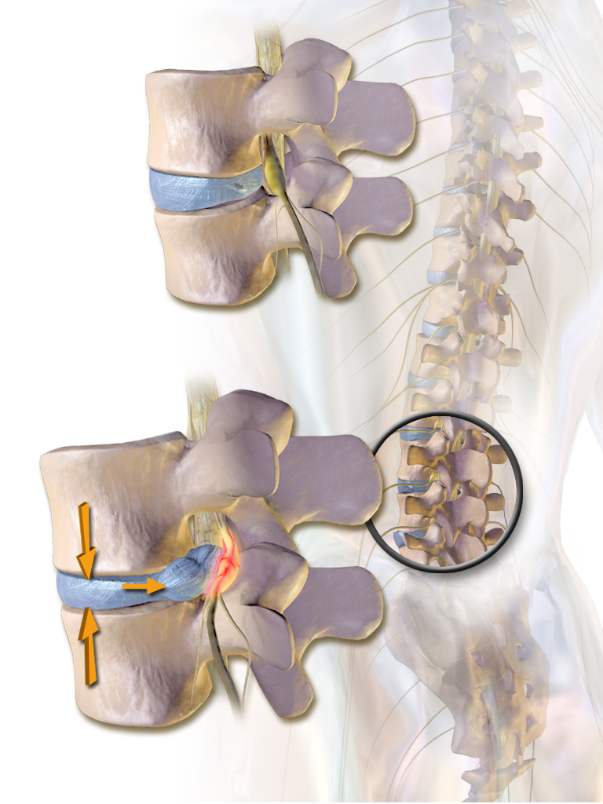

# Disc Extrusion

## Definition

A disc extrusion is a type of herniation in which the displaced disc material extends through a defect in the annulus fibrosus such that the herniated portion is **wider** than its base (neck) at the parent disc level, or extends above or below the disc level in the craniocaudal direction. This represents a more advanced form of herniation than a protrusion.

## Imaging Findings

<figure markdown="span">
  { width="400" }
  <figcaption>Diagram of a herniated intervertebral disc with nuclear material extending through the annulus fibrosus. (Wikimedia Commons, public domain)</figcaption>
</figure>

### MRI

- Focal disc extension with a **narrower base (neck) than the dome** — the key distinguishing feature from protrusion
- May migrate superiorly or inferiorly behind the vertebral body (craniocaudal migration)
- Signal may differ from parent disc — extruded fragment can have higher T2 signal if acutely hydrated
- Often causes significant mass effect on the thecal sac and nerve roots
- Best evaluated on **sagittal and axial T2** for extent and direction of migration

### Subligamentous vs Transligamentous

- **Subligamentous extrusion:** disc material passes through the annulus but remains contained beneath the posterior longitudinal ligament (PLL)
- **Transligamentous extrusion:** disc material penetrates through both the annulus and the PLL into the epidural space

!!! tip "Clinical Pearl"
    Disc extrusions, particularly large ones, have a **higher rate of spontaneous resorption** than protrusions. Studies show that up to 60–80% of extruded fragments decrease in size or completely resorb over 6–12 months, likely due to an inflammatory/immune response to the exposed nuclear material. This is a strong argument for initial conservative management in patients with extrusions who do not have progressive neurologic deficits or cauda equina syndrome.

## Key Points

- An extrusion has a dome wider than its base, or extends above/below the disc level
- Represents a more advanced herniation than protrusion — annular defect is full-thickness
- May migrate craniocaudally behind the vertebral bodies
- High rate of spontaneous resorption (60–80%) supports conservative management
- Urgent surgery only for progressive neurologic deficit or cauda equina syndrome

## References

1. Fardon DF, Williams AL, Dohring EJ, Murtagh FR, Gabriel Rothman SL, Sze GK. Lumbar disc nomenclature: version 2.0: Recommendations of the combined task forces of the North American Spine Society, the American Society of Spine Radiology and the American Society of Neuroradiology. *Spine J.* 2014;14(11):2525-2545. [PubMed](https://pubmed.ncbi.nlm.nih.gov/24768732/)
2. Disc extrusion. Radiopaedia.org. [Radiopaedia](https://radiopaedia.org/articles/disc-extrusion)
3. Ahn SH, Ahn MW, Byun WM. Effect of the transligamentous extension of lumbar disc herniations on their regression and the clinical outcome of sciatica. *Spine (Phila Pa 1976).* 2000;25(4):475-480. [PubMed](https://pubmed.ncbi.nlm.nih.gov/10707394/)
4. Weishaupt D, Zanetti M, Hodler J, Boos N. MR imaging of the lumbar spine: prevalence of intervertebral disk extrusion and sequestration, nerve root compression, end plate abnormalities, and osteoarthritis of the facet joints in asymptomatic volunteers. *Radiology.* 1998;209(3):661-666. [PubMed](https://pubmed.ncbi.nlm.nih.gov/9844656/)
5. Zeng Z, Qin J, Guo L, et al. Prediction and Mechanisms of Spontaneous Resorption in Lumbar Disc Herniation: Narrative Review. *Spine Surg Relat Res.* 2023. [PMC](https://pmc.ncbi.nlm.nih.gov/articles/PMC11165499/)
6. Yu P, Mao F, Chen J, et al. Characteristics and mechanisms of resorption in lumbar disc herniation. *Arthritis Res Ther.* 2022;24(1):205. [PMC](https://pmc.ncbi.nlm.nih.gov/articles/PMC9396855/)
7. Kesikburun B, Eksioglu E, Turan A, Adiguzel E, Kesikburun S, Cakci A. Spontaneous regression of extruded lumbar disc herniation: Correlation with clinical outcome. *Pak J Med Sci.* 2019;35(4):974-980. [PMC](https://pmc.ncbi.nlm.nih.gov/articles/PMC6659070/)

## Related Articles

- [Disc Bulge vs Herniation](disc-bulge-vs-herniation.md)
- [Disc Protrusion](disc-protrusion.md)
- [Disc Sequestration](disc-sequestration.md)
- [Lumbar Disc Herniation](lumbar-disc-herniation.md)
