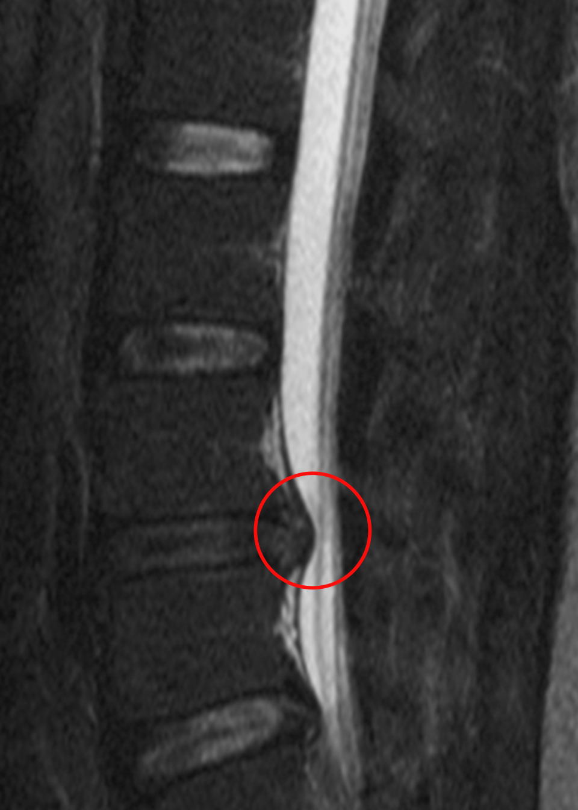

# Lumbar Disc Herniation

## Definition

Lumbar disc herniation is the focal displacement of disc material (nucleus pulposus, annulus fibrosus, or cartilaginous endplate) beyond the normal margin of the intervertebral disc space in the lumbar spine. It is the most common cause of lumbar radiculopathy and most frequently occurs at L4–L5 and L5–S1.

## Epidemiology

- Peak incidence: 30–50 years of age
- Most common levels: **L4–L5** (most common) and **L5–S1** (second most common)
- Most common location: **posterolateral (paracentral)** — where the annulus is thinnest and the PLL is narrowest
- Male > female

## Nerve Root Compression Patterns

In the lumbar spine, the relationship between herniation location and the affected nerve root follows predictable patterns:

| Level | Paracentral Herniation (Traversing Root) | Foraminal/Far Lateral (Exiting Root) |
|-------|----------------------------------------|--------------------------------------|
| **L3–L4** | L4 nerve root | L3 nerve root |
| **L4–L5** | L5 nerve root | L4 nerve root |
| **L5–S1** | S1 nerve root | L5 nerve root |

## Imaging Findings

<figure markdown="span">
  { width="400" }
  <figcaption>Sagittal MRI diagram showing a lumbar disc herniation compressing the thecal sac and nerve root. (Wikimedia Commons, CC BY-SA 3.0)</figcaption>
</figure>

### MRI (Gold Standard)

- **Sagittal T2:** disc extension beyond the vertebral margin; assess craniocaudal migration
- **Axial T2:** characterize location (central, paracentral, foraminal, far lateral) and nerve root relationship
- **Sagittal T1:** foraminal herniations — loss of bright epidural fat surrounding the nerve root
- Disc signal may be similar to or different from parent disc
- Look for nerve root displacement, compression, or edema (intradural root enhancement on post-contrast)

### Classification of Neural Effect

- **Contact:** herniation touches but does not deform the nerve root
- **Displacement:** nerve root is pushed away from its normal position
- **Compression:** nerve root is deformed between the herniation and an adjacent structure (e.g., pedicle, facet)

!!! tip "Clinical Pearl"
    **Far lateral (foraminal and extraforaminal) herniations** account for only 5–10% of lumbar herniations but are easily missed on routine MRI. They compress the **exiting** nerve root (one level higher than expected for a paracentral herniation at the same level). The key sequence is **sagittal T1 through the neural foramen** — loss of the normal bright fat around the dark nerve root indicates foraminal pathology. Always scroll laterally on axial images beyond the thecal sac.

## Key Points

- Most common at L4–L5 and L5–S1; most common location is posterolateral
- Paracentral herniations compress the traversing root; foraminal herniations compress the exiting root
- MRI is the gold standard — axial T2 for characterization, sagittal T1 for foraminal assessment
- Far lateral herniations are easily missed and must be specifically sought
- Most herniations improve with conservative management; surgery for progressive deficit or cauda equina syndrome

## References

1. Fardon DF, Williams AL, Dohring EJ, Murtagh FR, Gabriel Rothman SL, Sze GK. Lumbar disc nomenclature: version 2.0: Recommendations of the combined task forces of the North American Spine Society, the American Society of Spine Radiology, and the American Society of Neuroradiology. *Spine J*. 2014;14(11):2525-2545. [PubMed](https://pubmed.ncbi.nlm.nih.gov/24768732/)
2. Williams AL, Murtagh FR, Rothman SLG, Sze GK. Lumbar disc nomenclature: version 2.0. *AJNR Am J Neuroradiol*. 2014;35(11):2029. [PMC](https://pmc.ncbi.nlm.nih.gov/articles/PMC7965177/)
3. Smithuis R. Lumbar disc herniation and other causes of nerve compression. The Radiology Assistant. December 14, 2014. [radiologyassistant.nl](https://radiologyassistant.nl/neuroradiology/spine/lumbar-disc-herniation)
4. Al Qaraghli MI, De Jesus O. Lumbar disc herniation. In: *StatPearls*. Treasure Island (FL): StatPearls Publishing; updated August 23, 2023. [NCBI Bookshelf](https://www.ncbi.nlm.nih.gov/books/NBK560878/)
5. Berra LV, Di Rita A, Longhitano F, et al. Far lateral lumbar disc herniation part 1: Imaging, neurophysiology and clinical features. *World J Orthop*. 2021;12(12):961-969. [PMC](https://pmc.ncbi.nlm.nih.gov/articles/PMC8696601/)
6. Disc herniation. Radiopaedia.org. [radiopaedia.org/articles/disc-herniation](https://radiopaedia.org/articles/disc-herniation)

## Related Articles

- [Disc Bulge vs Herniation](disc-bulge-vs-herniation.md)
- [Far Lateral Disc Herniation](far-lateral-disc-herniation.md)
- [Cervical Disc Herniation](cervical-disc-herniation.md)
- [Lumbar Spinal Stenosis](lumbar-spinal-stenosis.md)
- [Lumbosacral Junction](../anatomy/lumbosacral-junction.md)
