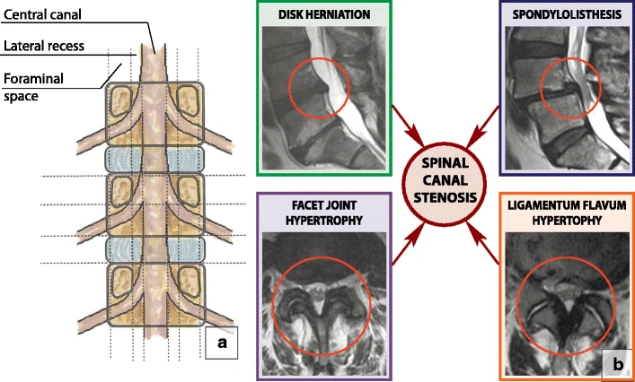

# Spinal Stenosis

## Definition

Spinal stenosis is the narrowing of the spinal canal, neural foramina, or lateral recesses resulting in compression of the neural elements (spinal cord, cauda equina, or nerve roots). It is one of the most common indications for spine surgery in adults over 65.

## Types by Location

<figure markdown="span">
  { width="550" }
  <figcaption>Four major causes of degenerative spinal canal stenosis: disc herniation, facet joint hypertrophy, ligamentum flavum hypertrophy, and spondylolisthesis. (CC BY-SA 4.0)</figcaption>
</figure>

| Type | Location | Structures Compressed |
|------|----------|----------------------|
| **Central canal stenosis** | Central spinal canal | Spinal cord (cervical/thoracic) or cauda equina (lumbar) |
| **Lateral recess stenosis** | Lateral recess (between pedicle and facet) | Traversing nerve root |
| **Foraminal stenosis** | Neural foramen | Exiting nerve root and dorsal root ganglion |

## Etiology

### Acquired (Degenerative) — Most Common
- Disc bulging or herniation (anterior narrowing)
- Ligamentum flavum hypertrophy (posterior narrowing)
- Facet hypertrophy and osteophytes (lateral narrowing)
- Degenerative spondylolisthesis (dynamic narrowing)
- Often a combination — "triple crush" or "trefoil" stenosis
- Additional causes of acquired spinal stenosis include iatrogenic, inflammatory, and traumatic etiologies

### Congenital
- Congenitally short pedicles → narrowed AP canal diameter
- More common in achondroplasia
- Patients with congenital stenosis become symptomatic earlier with less degenerative change

## Imaging Findings

### Grading — Schizas Classification (Lumbar Central Stenosis on Axial MRI)

| Grade | Description |
|-------|------------|
| **A** | No stenosis — CSF clearly visible around cauda equina roots |
| **B** | Moderate — rootlets occupy most of the thecal sac but are still individually distinguishable; some CSF visible |
| **C** | Severe — rootlets are not individually distinguishable; homogeneous gray signal fills thecal sac |
| **D** | Extreme — no recognizable CSF signal; complete obliteration |

### MRI Key Findings
- **Sagittal T2:** CSF effacement at one or more levels; cord or cauda equina compression
- **Axial T2:** assess canal shape — trefoil pattern suggests combined central and lateral stenosis
- **Cross-sectional area:** <100 mm² = severe central stenosis; <75 mm² = extreme

!!! tip "Clinical Pearl"
    **Neurogenic claudication** is the clinical hallmark of lumbar spinal stenosis — patients describe bilateral leg pain, heaviness, and weakness that worsens with walking and standing (extension narrows the canal further) and improves with sitting or leaning forward (flexion opens the canal). This distinguishes it from **vascular claudication**, which improves with standing still. The "shopping cart sign" — patients lean forward on a shopping cart to walk more comfortably — is classic.

## Key Points

- Stenosis can occur at three locations: central canal, lateral recess, and foramen
- Degenerative stenosis is the most common type — typically multifactorial (disc + ligament + facet)
- MRI is the primary modality — axial T2 for grading, sagittal T2 for overview
- Cross-sectional area <100 mm² = severe stenosis
- Neurogenic claudication (positional leg symptoms) is the classic lumbar stenosis presentation

## References

1. Hutchins TA, Peckham M, Shah LM, et al. ACR Appropriateness Criteria® Low Back Pain: 2021 Update. *J Am Coll Radiol*. 2021;18(11S):S361-S379. <https://pubmed.ncbi.nlm.nih.gov/34794594/>
2. Schizas C, Theumann N, Burn A, et al. Qualitative grading of severity of lumbar spinal stenosis based on the morphology of the dural sac on magnetic resonance images. *Spine (Phila Pa 1976)*. 2010;35(21):1919-1924. <https://pubmed.ncbi.nlm.nih.gov/20671589/>
3. Steurer J, Roner S, Gnannt R, Hodler J. Quantitative radiologic criteria for the diagnosis of lumbar spinal stenosis: a systematic literature review. *BMC Musculoskelet Disord*. 2011;12:175. <https://pmc.ncbi.nlm.nih.gov/articles/PMC3161920/>
4. Maus TP. Imaging of spinal stenosis: neurogenic intermittent claudication and cervical spondylotic myelopathy. *Radiol Clin North Am*. 2012;50(4):651-679. <https://pubmed.ncbi.nlm.nih.gov/22643390/>
5. Munakomi S, Cruz R. Lumbar Spinal Stenosis. *StatPearls*. Treasure Island (FL): StatPearls Publishing. <https://www.ncbi.nlm.nih.gov/books/NBK531493/>
6. Margetis K, Donnally CJ III. Cervical Myelopathy. *StatPearls*. Treasure Island (FL): StatPearls Publishing. <https://www.ncbi.nlm.nih.gov/books/NBK482312/>
7. Spinal stenosis. Radiopaedia.org. <https://radiopaedia.org/articles/spinal-stenosis-1>

## Related Articles

- [Central Canal Stenosis](central-canal-stenosis.md)
- [Lateral Recess Stenosis](lateral-recess-stenosis.md)
- [Foraminal Stenosis](foraminal-stenosis.md)
- [Lumbar Spinal Stenosis](lumbar-spinal-stenosis.md)
- [Cervical Spinal Stenosis](cervical-spinal-stenosis.md)
- [Ligamentum Flavum Hypertrophy](ligamentum-flavum-hypertrophy.md)
