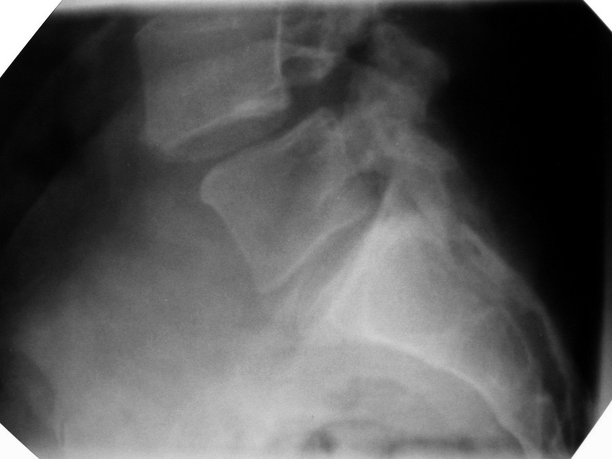

# Spondylolisthesis

## Definition

Spondylolisthesis is the anterior (or rarely posterior) displacement of one vertebra relative to the adjacent vertebra below. It is graded by the Meyerding classification based on the percentage of vertebral body translation, and has several distinct etiologic subtypes.

## Classification

<figure markdown="span">
  { width="450" }
  <figcaption>Lateral radiograph demonstrating spondylolisthesis — anterior displacement of one vertebra relative to the one below. (Wikimedia Commons)</figcaption>
</figure>

### Wiltse-Newman Classification (by Etiology)

| Type | Cause | Typical Level |
|------|-------|--------------|
| **I — Dysplastic (Congenital)** | Congenital deficiency of the superior sacral facets or inferior L5 facets | L5–S1 |
| **II — Isthmic** | Defect in the pars interarticularis (spondylolysis) — stress fracture, acute fracture, or elongation | L5–S1 (most common) |
| **III — Degenerative** | Facet and disc degeneration leading to segmental instability | L4–L5 (most common) |
| **IV — Traumatic** | Acute fracture of posterior elements other than the pars | Any level |
| **V — Pathologic** | Bone disease (tumor, infection, metabolic) weakening posterior elements | Any level |
| **VI — Iatrogenic (Post-surgical)** | Excessive resection of posterior elements during surgery | Any level |

### Meyerding Grading (Degree of Slip)

| Grade | Percent Translation |
|-------|-------------------|
| **I** | 0–25% |
| **II** | 25–50% |
| **III** | 50–75% |
| **IV** | 75–100% |
| **V (Spondyloptosis)** | >100% (complete displacement) |

## Imaging Findings

### Radiography
- **Lateral view:** anterior displacement of the superior vertebra relative to the inferior; measure percent slip
- **Oblique view:** pars defect visible as break in the "neck of the Scottie dog" (isthmic type)
- **Flexion-extension views:** determine if the slip is dynamic (changes with motion) or fixed

### CT
- Best for evaluating pars defects (isthmic type)
- Sagittal reformats for measuring slip percentage
- Can differentiate between spondylolysis (pars defect) and degenerative listhesis (intact pars)

### MRI
- Evaluate for nerve root compression, stenosis, and cord/cauda equina compression
- Disc degeneration at the slip level
- Sagittal T2 shows the degree of slip and canal compromise

!!! tip "Clinical Pearl"
    The key to spondylolisthesis classification is determining whether the **pars interarticularis is intact or defective**. If the pars is defective → isthmic spondylolisthesis. If the pars is intact → degenerative spondylolisthesis (or another subtype). This distinction has treatment implications: isthmic listhesis occurs because the posterior elements are disconnected from the vertebral body, while degenerative listhesis occurs from facet/disc degeneration despite an intact posterior arch. CT sagittal images through the pars are the best way to make this determination.

## Key Points

- Spondylolisthesis = anterior slip of one vertebra on the one below
- Meyerding grading: I (<25%), II (25–50%), III (50–75%), IV (75–100%), V (>100%)
- The Wiltse classification identifies the etiology — isthmic and degenerative are most common
- Pars integrity is the key distinguishing feature between isthmic and degenerative types
- Lateral radiograph for measuring slip; CT for pars assessment; MRI for neural compression

## Related Articles

- [Degenerative Spondylolisthesis](degenerative-spondylolisthesis.md)
- [Isthmic Spondylolisthesis](isthmic-spondylolisthesis.md)
- [Facet Joints](../anatomy/facet-joints.md)
- [Lumbar Spinal Stenosis](lumbar-spinal-stenosis.md)
- [Lumbosacral Junction](../anatomy/lumbosacral-junction.md)
