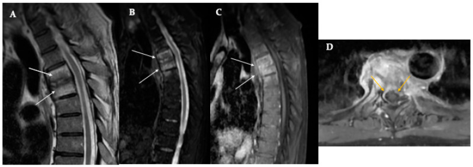

# Epidural Abscess

## Definition

A spinal epidural abscess (SEA) is a collection of purulent material in the epidural space that can compress the spinal cord or cauda equina. It is a surgical emergency when causing neurological compromise, as delays in decompression lead to irreversible deficits. Staphylococcus aureus is the causative organism in approximately 60–70% of cases.

## Etiology

- **Hematogenous spread** — Most common route (50%); from skin/soft tissue infections, endocarditis, UTI, or IV drug use
- **Direct extension** — From adjacent spondylodiscitis or paravertebral abscess
- **Direct inoculation** — Post-surgical, epidural injection, lumbar puncture

## Imaging Findings

### MRI (Modality of Choice)
- **Location** — The abscess is typically posterior in the thoracolumbar spine, extending over multiple vertebral segments
- **T1-weighted** — Iso- to hypointense collection in the epidural space displacing the thecal sac
- **T2-weighted** — Hyperintense collection
- **Post-contrast T1 with fat saturation** — **Rim enhancement** of the abscess capsule is the hallmark finding. The center of the abscess (pus) does not enhance, while the peripheral capsule enhances avidly.
- **DWI** — Restricted diffusion within the abscess (bright on DWI, dark on ADC) — helps distinguish abscess from other epidural collections
- **Cord compression** — Evaluate for displacement, compression, and signal change within the cord
- **Associated spondylodiscitis** — Present in 50–80% of cases

### CT
- Epidural soft tissue collection with rim enhancement
- Less sensitive than MRI, particularly for phlegmon (early pre-abscess stage)
- CT myelography if MRI is contraindicated

!!! tip "Clinical Pearl"
    The classic clinical triad of spinal epidural abscess is **fever, back pain, and neurological deficit** — but all three are present in only a minority of patients at initial presentation. The neurological deterioration can progress rapidly from radiculopathy to paraplegia within hours. A high index of suspicion in patients with risk factors (IVDU, diabetes, recent spinal procedure) and urgent MRI are essential. **Rim enhancement** on post-contrast MRI distinguishes a drainable abscess from phlegmon (diffuse enhancement without a drainable collection).

<figure markdown="span">
  { width="500" }
  <figcaption>Pyogenic spondylodiscitis with epidural extension. T2-weighted and post-contrast T1 MRI showing marrow edema, endplate destruction, disc involvement, and epidural enhancement with cord compression. (Source: PMC11591932, Biomedicines, 2024. CC BY 4.0)</figcaption>
</figure>

## Stages

1. **Phlegmon** — Early inflammatory stage without a drainable collection. MRI shows diffuse epidural enhancement without a rim-enhancing cavity. May respond to antibiotics alone.
2. **Abscess** — Mature collection with a capsule. MRI shows rim enhancement with a non-enhancing center. Typically requires surgical drainage.

## Management

- **Emergency surgical decompression** — Laminectomy and drainage for neurological deficit or progressive symptoms
- **Antibiotics** — Prolonged IV antibiotics (4–8 weeks minimum)
- **Medical management alone** — May be considered for small abscesses without neurological deficit (phlegmon stage) with close serial monitoring
- **Timing** — Outcomes correlate strongly with preoperative neurological status and time to decompression

## Key Points

- Spinal epidural abscess is a surgical emergency when causing cord compression
- S. aureus is the organism in 60–70% of cases
- Rim enhancement on post-contrast MRI is the hallmark — distinguishes abscess from phlegmon
- DWI showing restricted diffusion supports the diagnosis
- Typically posterior in the thoracolumbar spine, often spanning multiple levels
- Associated spondylodiscitis is present in 50–80%
- Neurological outcome depends on preoperative deficit severity and time to decompression

## Related Articles

- [Pyogenic Spondylodiscitis](pyogenic-spondylodiscitis.md)
- [Paravertebral Abscess](paravertebral-abscess.md)
- [Spinal Epidural Hematoma](../trauma/epidural-hematoma.md)
