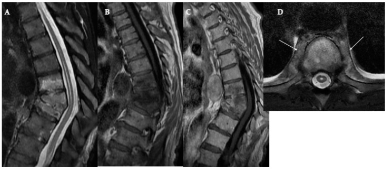

# Paravertebral Abscess

## Definition

A paravertebral abscess is a collection of purulent material in the paraspinal soft tissues, typically arising from contiguous spread of spondylodiscitis or vertebral osteomyelitis. It can also develop from direct inoculation (post-surgical, penetrating trauma) or hematogenous seeding. In the thoracolumbar spine, paravertebral abscesses may track along the psoas muscle, forming a psoas abscess.

## Imaging Findings

### MRI
- **Location** — Paraspinal soft tissues adjacent to the infected vertebral segment. In the lumbar spine, may extend into and along the psoas muscle bilaterally.
- **T1-weighted** — Iso- to hypointense collection in the paravertebral space
- **T2-weighted** — Hyperintense collection
- **Post-contrast** — **Rim enhancement** of the abscess wall with non-enhancing central pus. Surrounding soft tissue edema and enhancement.
- **DWI** — Restricted diffusion within the abscess
- **Associated spondylodiscitis** — Almost always present in pyogenic infections

### CT
- Rim-enhancing hypodense paravertebral collection
- May contain gas (strongly suggests pyogenic infection)
- CT is excellent for guiding percutaneous drainage
- Calcification within the abscess wall suggests chronic infection (tuberculosis)

<figure markdown="span">
  { width="500" }
  <figcaption>E. coli spondylodiscitis. Sagittal T2 and T1 post-contrast MRI showing vertebral body collapse, endplate destruction, and paravertebral soft tissue enhancement with epidural extension. (Source: PMC11591932, Biomedicines, 2024. CC BY 4.0)</figcaption>
</figure>

### Psoas Abscess

The psoas muscle runs from T12 to the lesser trochanter of the femur, providing a pathway for infection to track distally:

- The abscess may extend from the lumbar spine into the pelvis, groin, or thigh
- CT with contrast is the best modality for mapping the full extent
- Can be primary (hematogenous, associated with IVDU or immunosuppression) or secondary (from spondylodiscitis)

!!! tip "Clinical Pearl"
    A **psoas abscess** in the absence of obvious spondylodiscitis should still prompt evaluation of the lumbar spine — the vertebral infection may be subtle on initial imaging. Conversely, when spondylodiscitis is identified, always evaluate the psoas muscles for abscess extension, as undrained psoas abscesses are a common cause of treatment failure.

## Management

- **Percutaneous CT-guided drainage** — First-line for accessible abscesses; allows culture and sensitivity testing
- **Antibiotics** — IV antibiotics directed by culture results
- **Surgical drainage** — For complex, multiloculated, or inaccessible abscesses
- **Treatment of underlying spondylodiscitis** — Essential for preventing recurrence

## Key Points

- Paravertebral abscesses usually arise from contiguous spondylodiscitis
- Rim enhancement on post-contrast MRI/CT is the hallmark
- Psoas abscesses can track distally from lumbar spondylodiscitis
- CT-guided percutaneous drainage is first-line treatment
- Gas within the abscess strongly suggests pyogenic infection
- Calcified abscess wall suggests chronic infection (tuberculosis)

## References

1. Expert Panel on Neurological Imaging, Ortiz AO, Levitt A, Shah LM, et al. ACR Appropriateness Criteria® Suspected Spine Infection. *J Am Coll Radiol.* 2021;18(11S):S488-S501. <https://pubmed.ncbi.nlm.nih.gov/34794603/>
2. Ledbetter LN, Salzman KL, Shah LM. Imaging psoas sign in lumbar spinal infections: evaluation of diagnostic accuracy and comparison with established imaging characteristics. *AJNR Am J Neuroradiol.* 2016;37(4):736-741. <https://pmc.ncbi.nlm.nih.gov/articles/PMC7960153/>
3. Torres GM, Cernigliaro JG, Abbitt PL, et al. Iliopsoas compartment: normal anatomy and pathologic processes. *Radiographics.* 1995;15(6):1285-1297. <https://pubmed.ncbi.nlm.nih.gov/8577956/>
4. Al-Khafaji MQ, Al-Smadi MW, Al-Khafaji MQ, et al. Evaluating imaging techniques for diagnosing and drainage guidance of psoas muscle abscess: a systematic review. *J Clin Med.* 2024;13(11):3199. <https://pmc.ncbi.nlm.nih.gov/articles/PMC11173313/>
5. Raghavan M, Palestro CJ. Imaging of spondylodiscitis: an update. *Semin Nucl Med.* 2023;53(2):152-166. <https://pubmed.ncbi.nlm.nih.gov/36522190/>
6. Spondylodiscitis with psoas abscess. *Radiopaedia.org.* <https://radiopaedia.org/cases/spondylodiscitis-with-psoas-abscess>

## Related Articles

- [Epidural Abscess](epidural-abscess.md)
- [Pyogenic Spondylodiscitis](pyogenic-spondylodiscitis.md)
- [Spinal Tuberculosis](spinal-tuberculosis.md)
