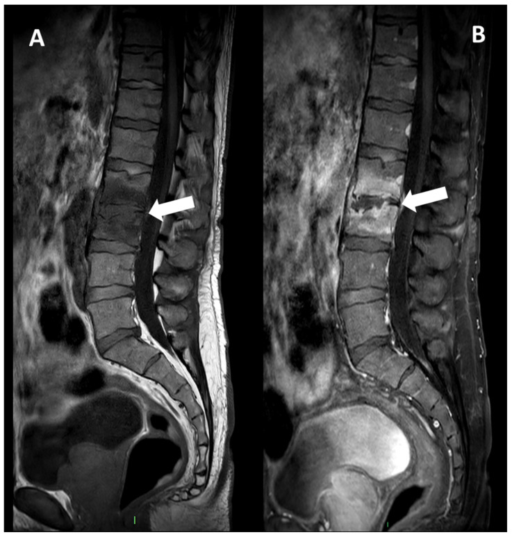

# Pyogenic Spondylodiscitis

## Definition

Pyogenic spondylodiscitis is a bacterial infection of the vertebral body and adjacent intervertebral disc. It is the most common form of spinal infection in developed countries, with Staphylococcus aureus responsible for 50–60% of cases. The lumbar spine is most frequently affected, followed by the thoracic and cervical spine.

## Pathophysiology

In adults, the intervertebral disc is avascular. Infection typically begins in the richly vascularized vertebral body endplate via hematogenous seeding and then spreads to the disc by direct extension through the endplate. This explains the classic pattern of vertebral endplate destruction flanking an infected disc.

In children, the disc retains its blood supply until approximately age 8, allowing direct hematogenous seeding of the disc (primary discitis).

## Imaging Findings

### MRI
- **T1-weighted** — Low signal in the adjacent vertebral body endplates and disc, with loss of the endplate cortical margin
- **T2-weighted/STIR** — High signal in the vertebral bodies, disc, and surrounding soft tissues. The disc shows increased T2 signal with loss of the normal intranuclear cleft.
- **Post-contrast** — Enhancement of the disc, vertebral endplates, and surrounding tissues. Look for epidural enhancement or abscess.
- **Endplate destruction** — Irregular, eroded endplates with loss of the normal cortical line

<figure markdown="span">
  { width="500" }
  <figcaption>Pyogenic spondylodiscitis of L2–L3. Sagittal T1 (A) and post-contrast T1 (B) MRI showing disc signal alteration, endplate erosions, and diffuse vertebral body enhancement. (Source: PMC11123694, Diagnostics, 2024. CC BY 4.0)</figcaption>
</figure>

### CT
- Endplate erosion and irregularity
- Disc space narrowing
- Paravertebral soft tissue swelling or abscess
- Sclerosis in chronic cases

### Radiography
- Early: normal or subtle disc space narrowing
- Late: endplate erosion, disc space loss, vertebral collapse
- Radiographs are insensitive for early disease — MRI is far superior

!!! tip "Clinical Pearl"
    Pyogenic spondylodiscitis typically involves **two adjacent vertebral bodies and the intervening disc** — this is the hallmark "2 vertebrae + 1 disc" pattern. The infection crosses the disc space because bacteria destroy the endplate and spread into the avascular disc. This disc-crossing pattern is the key feature distinguishing infection from most tumors, which typically destroy a single vertebral body while preserving the disc.

## Laboratory Findings

- Elevated ESR (most sensitive) and CRP (most specific for monitoring treatment response)
- Leukocytosis (may be absent in chronic or immunocompromised cases)
- Blood cultures positive in 40–60% of cases
- CT-guided biopsy for culture if blood cultures are negative

## Management

- **Antibiotics** — Prolonged course (typically 6–12 weeks of IV then oral antibiotics), guided by culture results
- **Immobilization** — Bracing for pain relief and prevention of progressive deformity
- **Surgery** — Indicated for neurological deficit from epidural abscess, spinal instability, failure of medical therapy, or need for tissue diagnosis

## Key Points

- Most common spinal infection in developed countries
- S. aureus is the causative organism in 50–60%
- "Two vertebrae + one disc" involvement pattern on MRI is the hallmark
- Disc T2 hyperintensity with endplate destruction distinguishes infection from degenerative changes
- ESR and CRP guide treatment response
- CT-guided biopsy when blood cultures are negative

## References

1. Berbari EF, Kanj SS, Kowalski TJ, et al. 2015 Infectious Diseases Society of America (IDSA) Clinical Practice Guidelines for the Diagnosis and Treatment of Native Vertebral Osteomyelitis in Adults. *Clin Infect Dis.* 2015;61(6):e26–e46. <https://pubmed.ncbi.nlm.nih.gov/26229122/>
2. Zimmerli W. Clinical practice. Vertebral osteomyelitis. *N Engl J Med.* 2010;362(11):1022–1029. <https://pubmed.ncbi.nlm.nih.gov/20237348/>
3. Expert Panel on Neurological Imaging, Ortiz AO, Levitt A, Shah LM, Parsons MS, et al. ACR Appropriateness Criteria® Suspected Spine Infection. *J Am Coll Radiol.* 2021;18(11S):S488–S501. <https://pubmed.ncbi.nlm.nih.gov/34794603/>
4. Crombé A, Fadli D, Clinca R, et al. Imaging of Spondylodiscitis: A Comprehensive Updated Review—Multimodality Imaging Findings, Differential Diagnosis, and Specific Microorganisms Detection. *Microorganisms.* 2024;12(5):893. <https://pmc.ncbi.nlm.nih.gov/articles/PMC11123694/>
5. Muscara JD, Blazar E. Diskitis. In: *StatPearls.* Treasure Island (FL): StatPearls Publishing; updated 2023 Mar 6. <https://www.ncbi.nlm.nih.gov/books/NBK541047/>
6. Pyogenic spondylitis. *Radiopaedia.org.* <https://radiopaedia.org/articles/pyogenic-spondylitis>

## Related Articles

- [Vertebral Osteomyelitis](vertebral-osteomyelitis.md)
- [Epidural Abscess](epidural-abscess.md)
- [Infection vs Tumor](infection-vs-tumor.md)
