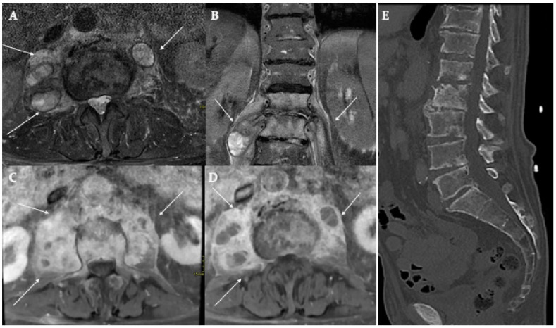

# Spinal Tuberculosis (Pott Disease)

## Definition

Spinal tuberculosis (Pott disease) is infection of the spine by Mycobacterium tuberculosis. It is the most common form of  musculoskeletal tuberculosis and the most common cause of spinal infection worldwide. 
 Pott disease characteristically involves the anterior vertebral body, causes severe kyphotic deformity (gibbus), and produces large paravertebral abscesses — features that distinguish it from pyogenic spondylodiscitis.

## Key Imaging Differences from Pyogenic Infection

| Feature | Tuberculosis | Pyogenic |
|---------|-------------|----------|
| Disc involvement | Late or absent (relative disc preservation) | Early (disc involved first) |
| Vertebral bodies | Multiple contiguous or skip lesions | Usually 2 adjacent bodies |
| Collapse pattern | Anterior wedging → gibbus deformity | Uniform height loss |
| Paravertebral abscess | Large, often calcified, "cold abscess" | Smaller, proportional |
| Posterior elements | Can be involved (unusual for pyogenic) | Rarely involved |
| Subligamentous spread | Characteristic — tracks under ALL across multiple levels | Less common |
| Skip lesions | Present in 7–10% | Rare |

## Imaging Findings

### MRI
- **Vertebral body** — Low T1, high T2/STIR signal centered in the anterior body. May show relative disc preservation early, with disc involvement developing later.
- **Gibbus deformity** — Anterior collapse of one or more vertebral bodies producing an acute kyphotic angulation
- **Paravertebral abscess** — Large rim-enhancing collections extending along the psoas muscle (psoas abscess) or along the prevertebral space. May be disproportionately large relative to the bony destruction.
- **Subligamentous spread** — Inflammatory tissue tracking beneath the anterior longitudinal ligament across multiple levels, a characteristic finding
- **Epidural extension** — Granulation tissue or abscess compressing the cord
- **Skip lesions** — Non-contiguous vertebral involvement separated by normal vertebrae

### CT
- Lytic destruction of the anterior vertebral body with relative disc preservation
- Large paravertebral abscess, often with calcification (chronic calcified abscess is suggestive of TB)
- Bone fragmentation and sequestra
- CT-guided biopsy for acid-fast bacilli culture and histology (caseating granulomas)

!!! tip "Clinical Pearl"
    The triad of **anterior vertebral body destruction + large paravertebral abscess + relative disc preservation** is highly suggestive of spinal tuberculosis rather than pyogenic infection. The paravertebral abscess is often described as a "cold abscess" because it forms without the acute inflammatory signs typical of pyogenic infection. Calcification within a paravertebral abscess is another clue to TB.

<figure markdown="span">
  { width="500" }
  <figcaption>Tubercular spondylodiscitis. Axial and coronal STIR, axial T1 post-contrast, and sagittal CT showing vertebral body destruction with bilateral psoas abscesses (arrows). (Source: PMC11591932, Biomedicines, 2024. CC BY 4.0)</figcaption>
</figure>

## Epidemiology

- Most common in the thoracic and thoracolumbar spine
- Endemic in developing countries; increasing in developed countries due to increase in multidrug-resistant mycobacteria, immigration, and HIV
- Peak incidence in children and young adults in endemic areas; older adults in non-endemic areas

## Management

- **Anti-tuberculous chemotherapy** — The mainstay of treatment (rifampin, isoniazid, pyrazinamide, ethambutol — RIPE regimen for 6–12+ months)
- **Surgery** — For neurological deficit, spinal instability, large abscess requiring drainage, or failure of medical therapy
- **Bracing** — For pain and prevention of progressive deformity

## Key Points

- Most common cause of spinal infection worldwide
- Anterior vertebral body destruction with relative disc preservation is characteristic
- Large "cold" paravertebral abscesses, often calcified, are typical
- Subligamentous spread under the ALL across multiple levels is a hallmark
- Gibbus deformity results from anterior vertebral collapse
- Skip lesions (7–10%) are a recognized feature — image the entire spine
- RIPE chemotherapy is the primary treatment

## References

1. Tobin EH, Rausch-Phung EA. Tuberculous Spondylitis (Pott Disease). In: *StatPearls.* Treasure Island (FL): StatPearls Publishing; updated 2026 Feb 15. <https://www.ncbi.nlm.nih.gov/books/NBK538331/>
2. Tuberculous spondylitis. *Radiopaedia.org.* <https://radiopaedia.org/articles/tuberculous-spondylitis-2>
3. Jain AK. Tuberculosis of the spine: a fresh look at an old disease. *J Bone Joint Surg Br.* 2010;92(7):905-913. <https://pubmed.ncbi.nlm.nih.gov/20595106/>
4. Burrill J, Williams CJ, Bain G, Conder G, Hine AL, Misra RR. Tuberculosis: a radiologic review. *RadioGraphics.* 2007;27(5):1255-1273. <https://pubmed.ncbi.nlm.nih.gov/17848689/>
5. Kubihal V, Sharma R, Krishna Kumar RG, Chandrashekhara SH, Garg R. Imaging update in spinal tuberculosis. *J Clin Orthop Trauma.* 2021;25:101742. <https://pmc.ncbi.nlm.nih.gov/articles/PMC8671643/>
6. Expert Panel on Neurological Imaging; Ortiz AO, Levitt A, Shah LM, Parsons MS, Agarwal V, et al. ACR Appropriateness Criteria® Suspected Spine Infection. *J Am Coll Radiol.* 2021;18(11S):S488-S501. <https://pubmed.ncbi.nlm.nih.gov/34794603/>

## Related Articles

- [Pyogenic Spondylodiscitis](pyogenic-spondylodiscitis.md)
- [Brucella Spondylitis](brucella-spondylitis.md)
- [Infection vs Tumor](infection-vs-tumor.md)
