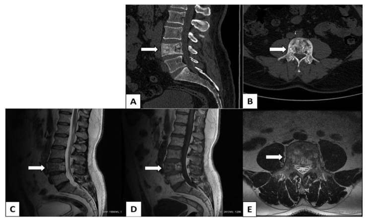

# Paget Disease

## Definition

Paget disease (osteitis deformans) is a chronic disorder of bone remodeling characterized by excessive osteoclastic resorption followed by disorganized osteoblastic new bone formation. The spine is involved in approximately 30–75% of patients. It typically affects patients over 55 years and is usually polyostotic.

## Imaging Findings

### Radiography/CT
- **Ivory vertebra** — Uniformly dense, sclerotic vertebral body (the classic Paget vertebra). Unlike blastic metastases (which also produce ivory vertebra), Paget disease shows vertebral body **enlargement**.
- **"Picture frame" vertebra** — Cortical thickening of the vertebral body margins with a relatively lucent center, creating a thick frame appearance
- **Vertebral body enlargement** — The vertebral body is expanded in all dimensions. This is the key distinguishing feature from blastic metastasis (which does not enlarge the vertebra).
- **Coarsened trabeculae** — Thickened, disorganized trabecular pattern

### MRI
- Variable signal depending on the phase (lytic vs sclerotic vs mixed)
- Sclerotic phase: low T1 and T2 signal (dense bone)
- May show fatty marrow in inactive areas
- Vertebral body enlargement is visible on MRI
- Epidural extension of pagetic bone can cause spinal stenosis and cord compression

### Nuclear Medicine
- Bone scan shows intensely increased uptake in affected vertebrae — very sensitive for detecting polyostotic involvement

<figure markdown="span">
  { width="500" }
  <figcaption>Paget disease of L4. (A) Sagittal CT showing an enlarged, squared vertebral body with cortical thickening and coarsened trabeculae. (B) Axial CT showing sclerotic remodeling extending into the pedicles and neural arch. (C-D) Sagittal T1 and T2 MRI showing heterogeneous marrow signal with enlargement. (Source: PMC9953426, Biomedicines, 2023. CC BY 4.0)</figcaption>
</figure>

!!! tip "Clinical Pearl"
    The key distinction between an **ivory vertebra from Paget disease vs blastic metastasis**: Paget disease **enlarges** the vertebral body (expanded in AP and transverse dimensions), while metastasis does not change vertebral body size. On CT, Paget shows cortical thickening ("picture frame"), while blastic metastasis shows diffuse sclerosis without cortical thickening. Also check the pedicles — in Paget, the pedicles and posterior elements are often involved and enlarged.

## Key Points

- Excessive bone remodeling producing sclerosis, enlargement, and disorganized trabeculae
- Ivory vertebra with vertebral body enlargement is characteristic
- "Picture frame" vertebra on CT — cortical thickening with lucent center
- Vertebral body enlargement distinguishes Paget from blastic metastasis
- Spinal stenosis and cord compression can occur from epidural pagetic bone
- Bone scan is very sensitive for polyostotic disease

## References

1. Smith SE, Murphey MD, Motamedi K, Mulligan ME, Resnik CS, Gannon FH. From the archives of the AFIP. Radiologic spectrum of Paget disease of bone and its complications with pathologic correlation. *RadioGraphics.* 2002;22(5):1191-1216. <https://pubmed.ncbi.nlm.nih.gov/12235348/>
2. Theodorou DJ, Theodorou SJ, Kakitsubata Y. Imaging of Paget disease of bone and its musculoskeletal complications: review. *AJR Am J Roentgenol.* 2011;196(6 Suppl):S64-S75. <https://pubmed.ncbi.nlm.nih.gov/21606236/>
3. Dell'Atti C, Cassar-Pullicino VN, Lalam RK, Tins BJ, Tyrrell PNM. The spine in Paget's disease. *Skeletal Radiol.* 2007;36(7):609-626. <https://pubmed.ncbi.nlm.nih.gov/17410356/>
4. Hadjipavlou AG, Gaitanis IN, Katonis PG, Lander P. Paget's disease of the spine and its management. *Eur Spine J.* 2001;10(5):370-384. <https://pmc.ncbi.nlm.nih.gov/articles/PMC3611523/>
5. Saifuddin A, Hassan A. Paget's disease of the spine: unusual features and complications. *Clin Radiol.* 2003;58(2):102-111. <https://pubmed.ncbi.nlm.nih.gov/12623038/>
6. Anastasopoulou C, Mikes BA. Paget Bone Disease. In: *StatPearls.* Treasure Island (FL): StatPearls Publishing; updated 2023 Nov 12. <https://www.ncbi.nlm.nih.gov/books/NBK430805/>
7. Paget disease (bone). *Radiopaedia.org.* <https://radiopaedia.org/articles/paget-disease-bone>

## Related Articles

- [Blastic vs Lytic Metastases](../neoplasms/blastic-vs-lytic.md)
- [Vertebral Body Metastases](../neoplasms/vertebral-metastases.md)
