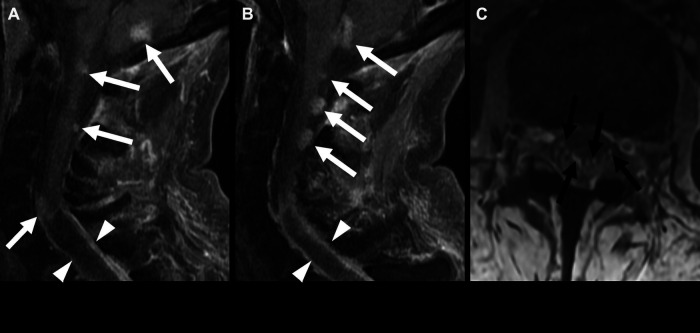

# Drop Metastases

## Definition

Drop metastases (leptomeningeal carcinomatosis or leptomeningeal metastases) refer to tumor cells that disseminate through the cerebrospinal fluid (CSF) and deposit on the surface of the spinal cord, nerve roots, and cauda equina. The term "drop" reflects the tendency of tumor cells to settle by gravity into the dependent portions of the thecal sac, particularly the thoracolumbar region and cauda equina.

## Etiology

### Intracranial Tumors (Most Common Source)
- **Medulloblastoma** — Highest propensity for CSF dissemination among brain tumors
- **Ependymoma**
- **Pilocytic astrocytoma**
- **Choroid plexus tumors**
- **GBM (glioblastoma)**
- **Pineoblastoma**

### Spinal Tumors
- Myxopapillary ependymoma
- Spinal ependymoma
- Spinal astrocytoma

### Systemic Cancers
- Breast, lung, melanoma, lymphoma/leukemia (leptomeningeal carcinomatosis)

## Imaging Findings

### MRI (Post-Contrast T1 with Fat Saturation)
- **Nodular enhancement** — Discrete nodules of enhancement on the surface of the cord, conus, or nerve roots of the cauda equina. The nodules are intradural extramedullary.
- **"Sugar coating" or "frosting"** — Thin, linear enhancement coating the cord surface and nerve roots in diffuse leptomeningeal disease
- **Clumping of cauda equina nerve roots** — Thickened, enhancing nerve roots that clump together
- **Intradural nodules** — Discrete enhancing masses within the thecal sac, particularly in the dependent portions (lower thoracic, lumbar, sacral)

### Pre-Contrast MRI
- Nodules may be visible on T2 as intermediate signal masses within the CSF
- FLAIR (if available for spine) may show CSF signal abnormality

!!! tip "Clinical Pearl"
    **Post-contrast T1 with fat saturation of the entire spine** is the essential sequence for detecting drop metastases. Pre-contrast T1 should also be obtained to avoid confusing pre-existing T1-bright substances (fat, blood products) with enhancement. In patients with medulloblastoma, ependymoma, or other tumors prone to CSF dissemination, whole-spine post-contrast MRI is part of standard staging.

<figure markdown="span">
  { width="500" }
  <figcaption>MYCN-amplified spinal ependymoma with leptomeningeal spread. Post-contrast MRI showing multiple enhancing nodules in the posterior fossa, cervical cord, and cauda equina consistent with drop metastases. (Source: Defined et al., Front Pediatr, 2023. CC BY 4.0)</figcaption>
</figure>

## Clinical Significance

Drop metastases change staging and treatment. Their presence typically upstages the primary tumor and affects the radiation treatment plan — craniospinal irradiation may be indicated when drop metastases are identified.

## Key Points

- Drop metastases spread via CSF to coat the cord, nerve roots, and cauda equina
- Post-contrast T1 fat-saturated MRI of the entire spine is the essential imaging study
- Nodular enhancement on the cord/root surfaces and cauda equina clumping are characteristic
- Medulloblastoma has the highest propensity for CSF dissemination
- Detection changes staging and treatment (may require craniospinal irradiation)

## References

1. Nguyen A, Nguyen A, Dada OT, Desai PD, Ricci JC, Godbole NB, et al. Leptomeningeal Metastasis: A Review of the Pathophysiology, Diagnostic Methodology, and Therapeutic Landscape. Curr Oncol. 2023;30(6):5906-5931. PMID: 37366925.
2. Meyers SP, Wildenhain SL, Chang JK, Bourekas EC, Beattie PF, Korones DN, et al. Postoperative Evaluation for Disseminated Medulloblastoma Involving the Spine: Contrast-enhanced MR Findings, CSF Cytologic Analysis, Timing of Disease Occurrence, and Patient Outcomes. AJNR Am J Neuroradiol. 2000;21(9):1757-1765. PMID: 11039362.
3. Fults DW, Taylor MD, Garzia L. Leptomeningeal dissemination: a sinister pattern of medulloblastoma growth. J Neurosurg Pediatr. 2019;23(5):613-621. PMID: 30771762.
4. Palmisciano P, Sagoo NS, Kharbat AF, Kenfack YJ, Bin Alamer O, Scalia G, et al. Leptomeningeal Metastases of the Spine: A Systematic Review. Anticancer Res. 2022;42(2):619-628.
5. Koeller KK, Shih RY. Intradural Extramedullary Spinal Neoplasms: Radiologic-Pathologic Correlation. RadioGraphics. 2019;39(2):468-490. PMID: 30844353.
6. Gaillard F, et al. Leptomeningeal metastases. Radiopaedia.org. Available from: https://radiopaedia.org/articles/leptomeningeal-metastases
7. Gaillard F, et al. Leptomeningeal drop metastases. Radiopaedia.org. Available from: https://radiopaedia.org/articles/leptomeningeal-drop-metastases-2

## Related Articles

- [Myxopapillary Ependymoma](myxopapillary-ependymoma.md)
- [Ependymoma](ependymoma.md)
- [Epidural Metastases and Cord Compression](epidural-metastases.md)
