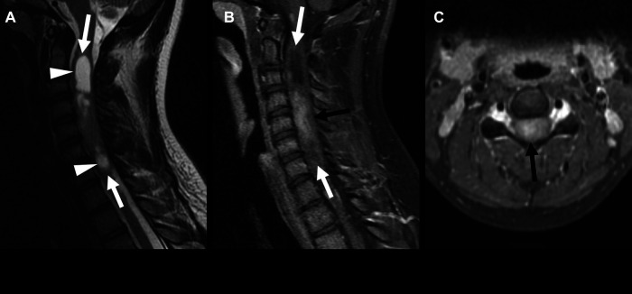

# Ependymoma

## Definition

Ependymoma is the most common intramedullary spinal cord tumor in adults, arising from ependymal cells lining the central canal. It is typically a well-circumscribed, slow-growing tumor that arises centrally within the cord and often has a surgical cleavage plane, making gross total resection possible.

## Imaging Findings

### MRI
- **Location** — Intramedullary, centrally located within the cord. Most common in the cervical cord and cervicothoracic junction.
- **T1-weighted** — Isointense to slightly hypointense
- **T2-weighted** — Hyperintense, well-defined margins
- **Enhancement** — Intense, homogeneous enhancement (a key distinguishing feature from astrocytoma)
- **Hemosiderin cap** — Low T2 signal "cap" at the superior and/or inferior poles of the tumor, representing prior microhemorrhages. This is a highly characteristic finding of ependymoma.
- **Intratumoral cysts** — Common; appear as T2-bright, non-enhancing areas within the tumor
- **Associated syrinx** — Reactive syrinx may be present at the poles
- **Cord expansion** — Usually over 3–4 vertebral segments (shorter than astrocytoma)

### CT
- Not the primary modality; may show cord expansion on CT myelography

!!! tip "Clinical Pearl"
    The **hemosiderin cap** — a rim of T2-dark signal (GRE/SWI accentuated) at the poles of an intramedullary tumor — is highly suggestive of ependymoma. It results from the tumor's tendency to bleed at its margins. Combined with central cord location, well-defined margins, and homogeneous enhancement, this is a near-pathognomonic combination.

<figure markdown="span">
  { width="500" }
  <figcaption>Cervical spinal cord ependymoma in a 17-year-old with NF2. Sagittal T2-weighted images showing cystic areas, with post-contrast images demonstrating enhancement of the solid tumor components and expansion of the cervical cord. (Source: Defined et al., Front Pediatr, 2023. CC BY 4.0)</figcaption>
</figure>

## Subtypes

- **Cellular ependymoma (WHO grade II)** — The most common subtype in the cervical cord
- **Myxopapillary ependymoma** — A distinct variant occurring at the conus medullaris and filum terminale (see [Myxopapillary Ependymoma](myxopapillary-ependymoma.md))
- **Anaplastic ependymoma (WHO grade III)** — Rare, more aggressive

## Management

- Gross total resection is the treatment of choice and is often achievable due to the cleavage plane between tumor and cord
- Radiation therapy for incomplete resection or recurrence
- Long-term surveillance MRI is essential (recurrence can occur years later)

## Key Points

- Most common intramedullary tumor in adults
- Central cord location, well-defined margins, homogeneous enhancement
- Hemosiderin cap is highly characteristic
- Gross total resection is often achievable (unlike astrocytoma)
- Myxopapillary ependymoma is a distinct subtype at the conus/filum

## References

1. Karsonovich T, Hall WA. Ependymoma. In: StatPearls. Treasure Island (FL): StatPearls Publishing; updated 2025 Nov 13. Available from: https://www.ncbi.nlm.nih.gov/books/NBK538244/
2. Davidson CL, Das JM, Mesfin FB. Intramedullary Spinal Cord Tumors. In: StatPearls. Treasure Island (FL): StatPearls Publishing; updated 2024 Jun 7. Available from: https://www.ncbi.nlm.nih.gov/books/NBK442031/
3. Cerretti G, et al. Spinal ependymoma in adults: from molecular advances to new treatment perspectives. Front Oncol. 2023;13:1301179. Available from: https://www.frontiersin.org/journals/oncology/articles/10.3389/fonc.2023.1301179/full
4. Yuh EL, Barkovich AJ, Gupta N. Imaging of ependymomas: MRI and CT. Childs Nerv Syst. 2009;25(10):1203–13. Available from: https://pmc.ncbi.nlm.nih.gov/articles/PMC2744772/
5. Choi JY, Chang KH, Yu IK, Kim KH, Kwon BJ, Han MH, Kim IO. Intracranial and spinal ependymomas: review of MR images in 61 patients. Korean J Radiol. 2002;3(4):219–28. Available from: https://pmc.ncbi.nlm.nih.gov/articles/PMC2713843/
6. Spinal ependymoma. Radiopaedia.org. Available from: https://radiopaedia.org/articles/spinal-ependymoma

## Related Articles

- [Myxopapillary Ependymoma](myxopapillary-ependymoma.md)
- [Astrocytoma](astrocytoma.md)
- [Drop Metastases](drop-metastases.md)
