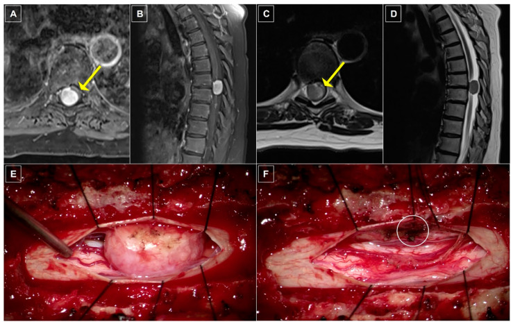
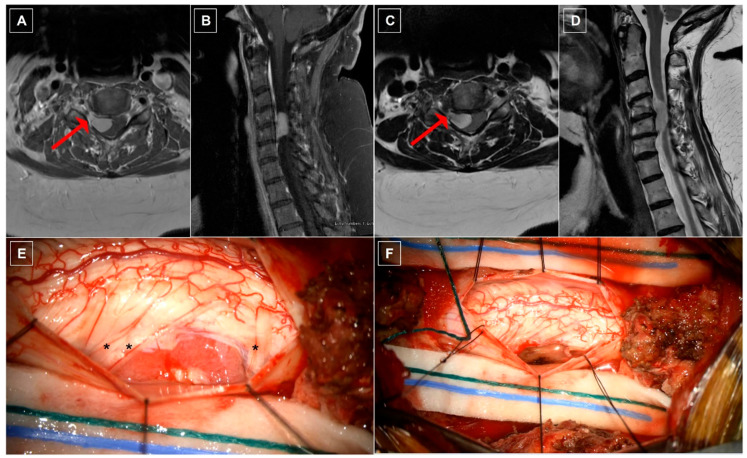
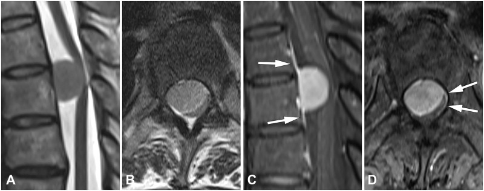

# Meningioma

## Definition

Meningioma is a benign tumor arising from arachnoid cap cells of the meninges. Spinal meningiomas are the second most common intradural extramedullary tumor after schwannoma. They are strongly associated with middle-aged to older women (female-to-male ratio approximately 4:1) and most commonly occur in the thoracic spine.

## Imaging Findings

### MRI
- **Location** — Intradural extramedullary, most commonly in the thoracic spine (80%). Typically lateral or posterolateral, arising from the dura.
- **T1-weighted** — Isointense to the spinal cord
- **T2-weighted** — Isointense to slightly hyperintense to the cord (much less bright than schwannomas)
- **Enhancement** — Intense, homogeneous enhancement
- **Dural tail sign** — Linear enhancement of the dura extending from the tumor margins, present in approximately 60% of cases. While not pathognomonic (can be seen with other dural-based lesions), it is a strong clue to the diagnosis.
- **Broad dural base** — The tumor has a wide attachment to the dura, unlike nerve sheath tumors which are more spherical/eccentric
- **CSF cap** — CSF visible between the tumor and the cord
- **Calcification** — May appear as signal void on all sequences

### CT
- Iso- to hyperdense mass (may show calcification)
- Homogeneous enhancement
- No foraminal widening (unlike schwannoma)
- CT myelography shows intradural filling defect

<figure markdown="span">
  { width="500" }
  <figcaption>Thoracic spinal meningioma at T7–T8. Sagittal and axial T1 post-contrast MRI showing a homogeneously enhancing intradural extramedullary mass with ventral displacement and compression of the spinal cord. (Source: PMC11011121, Medicina, 2024. CC BY 4.0)</figcaption>
</figure>

<figure markdown="span">
  { width="500" }
  <figcaption>Cervical spinal meningioma at C4–C6. Sagittal and axial T1 post-contrast and T2-weighted MRI showing a ventrolateral enhancing mass with extension into the neural foramen. (Source: PMC11011121, Medicina, 2024. CC BY 4.0)</figcaption>
</figure>

<figure markdown="span">
  { width="500" }
  <figcaption>Spinal meningioma at T12. T2-weighted and post-contrast T1-weighted MRI showing the dural tail sign — linear enhancement of the dura extending from the tumor margins (arrows). (Source: Yoo et al., PLoS ONE, 2020. CC BY 4.0)</figcaption>
</figure>

## Distinguishing from Schwannoma

| Feature | Meningioma | Schwannoma |
|---------|-----------|------------|
| Location | Thoracic (80%) | Lumbar/cervical more common |
| Dural attachment | Broad-based | Eccentric, nerve root based |
| Dural tail | Present (~60%) | Absent |
| T2 signal | Isointense to cord | Hyperintense |
| Cystic change | Rare | Common |
| Foraminal extension | Rare | Common (dumbbell) |
| Demographics | Women 40–70 | No sex predilection |

!!! tip "Clinical Pearl"
    A well-defined, homogeneously enhancing intradural extramedullary mass in the **thoracic spine** of a **middle-aged woman** with a **broad dural base** and **dural tail sign** is virtually diagnostic of meningioma. This clinical-imaging combination is highly specific.

## Management

- Surgical excision is curative in most cases
- Recurrence rate depends on completeness of resection (Simpson grade)
- Observation may be appropriate for small, asymptomatic lesions in elderly patients

## Key Points

- Second most common intradural extramedullary tumor
- Strong predilection for thoracic spine in middle-aged women
- Homogeneous enhancement with dural tail and broad dural base
- T2 signal is isointense to cord (unlike T2-bright schwannomas)
- Surgical excision is usually curative

## References

1. Dang DD, Mugge LA, Awan OK, Gong AD, Fanous AA. Spinal meningiomas: a comprehensive review and update on advancements in molecular characterization, diagnostics, surgical approach and technology, and alternative therapies. Cancers (Basel). 2024;16(7):1426. Available from: https://pmc.ncbi.nlm.nih.gov/articles/PMC11011121/
2. Koeller KK, Shih RY. Intradural extramedullary spinal neoplasms: radiologic-pathologic correlation. RadioGraphics. 2019;39(2):468-90. Available from: https://pubmed.ncbi.nlm.nih.gov/30844353/
3. Zhang LH, Yuan HS. Imaging appearances and pathologic characteristics of spinal epidural meningioma. AJNR Am J Neuroradiol. 2018;39(1):199-204. Available from: https://pubmed.ncbi.nlm.nih.gov/29051204/
4. Alorainy IA. Dural tail sign in spinal meningiomas. Eur J Radiol. 2006;60(3):387-91. Available from: https://pubmed.ncbi.nlm.nih.gov/16876365/
5. El-Hajj VG, Pettersson-Segerlind J, Fletcher-Sandersjöö A, Edström E, Elmi-Terander A. Current knowledge on spinal meningiomas epidemiology, tumor characteristics and non-surgical treatment options: a systematic review and pooled analysis (Part 1). Cancers (Basel). 2022;14(24):6251. Available from: https://pmc.ncbi.nlm.nih.gov/articles/PMC9776907/
6. Alruwaili AA, De Jesus O. Meningioma. In: StatPearls. Treasure Island (FL): StatPearls Publishing; 2024. Available from: https://www.ncbi.nlm.nih.gov/books/NBK560538/
7. Spinal meningioma. Radiopaedia.org. Available from: https://radiopaedia.org/articles/spinal-meningioma

## Related Articles

- [Schwannoma](schwannoma.md)
- [Neurofibroma](neurofibroma.md)
- [Extradural vs Intradural Classification](extradural-intradural-classification.md)
