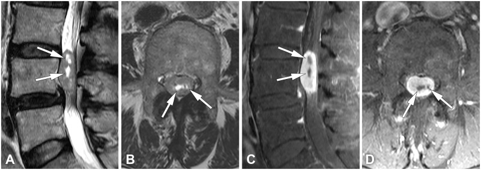

# Schwannoma

## Definition

Schwannoma (neurilemmoma) is a benign nerve sheath tumor arising from Schwann cells. It is the most common intradural extramedullary spinal tumor and the most common spinal nerve sheath tumor overall. Schwannomas typically arise from a single nerve root fascicle and can be separated from the parent nerve at surgery, unlike neurofibromas which are intertwined with nerve fibers.

## Imaging Findings

### MRI
- **Location** — Intradural extramedullary mass, typically arising from a dorsal sensory nerve root. Most common in the lumbar and cervical spine.
- **T1-weighted** — Isointense to slightly hypointense relative to the cord
- **T2-weighted** — Hyperintense, often heterogeneous. Cystic changes, hemorrhage, and the "target sign" (peripheral high signal with central low signal) may be present.
- **Enhancement** — Intense, often homogeneous enhancement. Larger tumors may show heterogeneous enhancement with non-enhancing cystic/necrotic areas.
- **CSF cap** — CSF visible between the tumor and the cord, confirming extramedullary location
- **Dumbbell morphology** — May extend through the neural foramen into the paravertebral space (see [Dumbbell Lesions](dumbbell-lesions.md))
- **Foraminal widening** — Smooth expansion of the neural foramen

### CT
- Isodense to slightly hyperdense mass in the spinal canal
- Foraminal widening and smooth bony remodeling
- CT myelography can demonstrate the intradural mass as a filling defect

!!! tip "Clinical Pearl"
    The key MRI features distinguishing schwannoma from meningioma (the two most common intradural extramedullary tumors): Schwannomas arise from a nerve root (eccentric, may extend through the foramen as a dumbbell), are T2-hyperintense, and may be cystic. Meningiomas are dura-based (broad dural attachment), have a "dural tail" sign, and are more common in the thoracic spine in middle-aged women.

<figure markdown="span">
  { width="500" }
  <figcaption>Spinal schwannoma at L4. Sagittal and axial T2-weighted images showing an intradural extramedullary mass with cystic change (arrows). Post-contrast T1 images show enhancement with non-enhancing cystic portions. (Source: Yoo et al., PLoS ONE, 2020. CC BY 4.0)</figcaption>
</figure>

## Multiple Schwannomas

Multiple spinal schwannomas should raise concern for **schwannomatosis** or **neurofibromatosis type 2 (NF2)**. NF2 is associated with bilateral vestibular schwannomas, multiple spinal schwannomas, and meningiomas.

## Management

- Surgical excision with nerve-sparing technique (schwannomas can be separated from the parent nerve)
- Recurrence is rare after complete excision
- Stereotactic radiosurgery for surgically inaccessible lesions

## Key Points

- Most common intradural extramedullary spinal tumor
- Arises from Schwann cells of the dorsal sensory nerve root
- T2-hyperintense, avidly enhancing, may have cystic components
- Dumbbell extension through the neural foramen is characteristic
- Can be separated from the parent nerve at surgery (unlike neurofibroma)
- Multiple schwannomas suggest NF2 or schwannomatosis

## Related Articles

- [Meningioma](meningioma.md)
- [Neurofibroma](neurofibroma.md)
- [Dumbbell Lesions](dumbbell-lesions.md)
