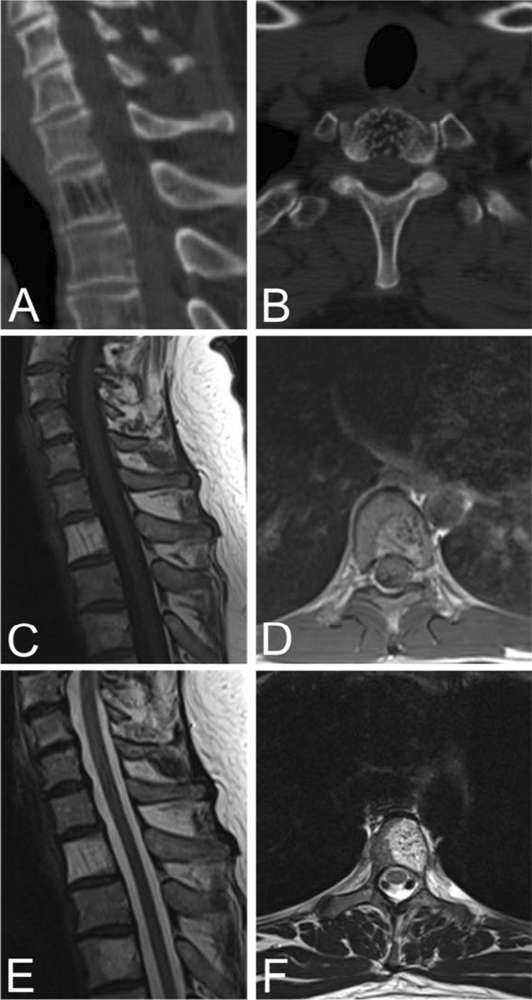
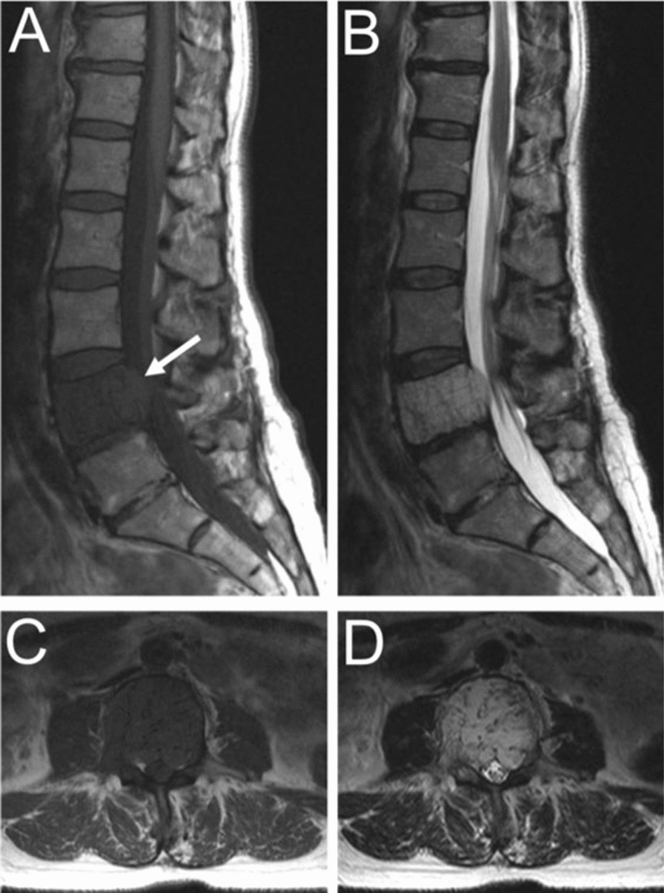

# Vertebral Hemangioma

## Definition

Vertebral hemangiomas are the most common benign tumor of the vertebral body, consisting of vascular channels interspersed among thickened vertical trabeculae and fat. They are found incidentally in approximately 10–12% of spinal MRI studies and are overwhelmingly asymptomatic. Rarely, aggressive hemangiomas can extend into the epidural space and cause cord compression.

## Imaging Findings

### Typical (Incidental) Hemangioma

**MRI:**

- **T1-weighted** — High signal (bright) due to fat content between the vascular channels
- **T2-weighted** — High signal (bright) due to both fat and slow-flowing blood
- The combination of high T1 AND high T2 signal is characteristic and essentially diagnostic

**CT:**

- Classic "polka-dot" pattern on axial images — thickened vertical trabeculae in cross-section appear as scattered dots within a low-attenuation (fatty) matrix
- "Corduroy" or "jail bar" pattern on sagittal images — vertical striations from the thickened trabeculae

<figure markdown="span">
  { width="500" }
  <figcaption>Typical vertebral hemangioma. (A) Sagittal CT showing the corduroy sign. (B) Axial CT showing the polka-dot sign. (C–D) Sagittal and axial T1-weighted MRI showing hyperintense signal. (E–F) Sagittal and axial T2-weighted MRI also showing hyperintensity. (Source: Kato et al., J Orthop Surg Res, 2024. CC BY 4.0)</figcaption>
</figure>

### Aggressive (Atypical) Hemangioma

Features suggesting an aggressive hemangioma that may cause symptoms:

- **Low T1 signal** — Indicates less fat content and more vascular tissue
- **Epidural extension** — Soft tissue extending into the epidural space
- **Entire vertebral body involvement** — Replacing the whole body rather than a focal area
- **Cortical expansion or erosion**
- **Posterior element involvement**
- **Enhancement** — More avid, sometimes homogeneous enhancement

<figure markdown="span">
  { width="500" }
  <figcaption>Aggressive vertebral hemangioma of L4. (A) Sagittal T1 MRI showing hypointensity of the entire vertebral body. (B) Sagittal T2 showing hyperintensity with epidural extension. (C–D) Axial T1 and T2 showing bilateral pedicle involvement and anterior epidural extension. (Source: Kato et al., J Orthop Surg Res, 2024. CC BY 4.0)</figcaption>
</figure>

!!! tip "Clinical Pearl"
    The classic high T1 / high T2 signal hemangioma is a "do not touch" lesion — no follow-up, biopsy, or treatment is needed. The danger is the **atypical hemangioma** with low T1 signal, which can mimic a metastasis. Key distinguishing features include the characteristic CT trabecular pattern (polka-dot/corduroy) and the absence of cortical destruction or pedicle involvement. If there is any doubt, CT can resolve the diagnosis.

## Epidemiology

- Present in 10–12% of the population
- More common in the thoracic and lumbar spine
- Slightly more common in women
- Most are discovered incidentally and require no treatment

## Management

- **Typical hemangiomas** — No treatment or follow-up needed
- **Aggressive hemangiomas with cord compression** — Treatment options include embolization, radiation therapy, vertebroplasty, or surgical decompression

## Key Points

- Vertebral hemangiomas are the most common benign vertebral tumor
- High T1 and high T2 signal on MRI is characteristic (fat + vascular)
- "Polka-dot" pattern on axial CT and "corduroy" pattern on sagittal CT are diagnostic
- Atypical hemangiomas with low T1 signal can mimic metastases — CT confirms the diagnosis
- Aggressive hemangiomas with epidural extension are rare but may require treatment

## Related Articles

- [Spine Tumors Overview](spine-tumors-overview.md)
- [Vertebral Body Metastases](vertebral-metastases.md)
