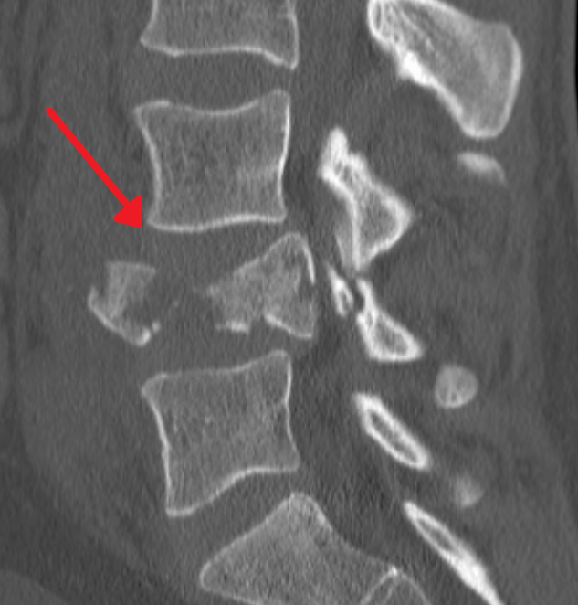
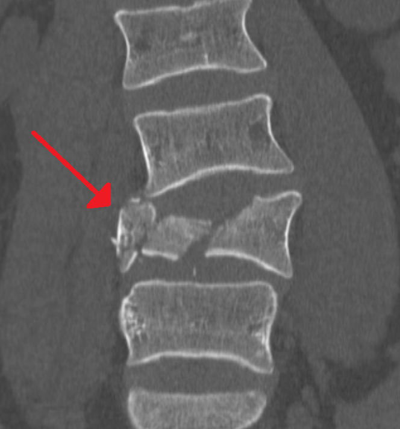
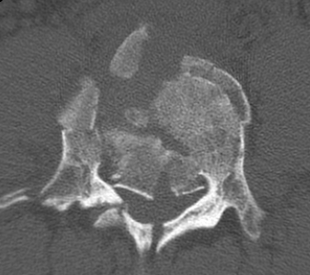

# Thoracolumbar Burst Fracture

## Definition

A burst fracture is a fracture of a vertebral body in which axial loading causes failure of both the anterior and middle columns, resulting in comminution of the vertebral body with retropulsion of bone fragments into the spinal canal. Burst fractures are distinguished from simple compression fractures by involvement of the posterior vertebral body wall (middle column) and the potential for spinal canal compromise and neurological injury.

## Mechanism of Injury

Burst fractures result from high-energy axial compression, typically from:

- Falls from height (landing on the feet or buttocks)
- Motor vehicle collisions
- Diving injuries

The thoracolumbar junction (T11–L2) is the most common location because it represents the transition from the rigid, kyphotic thoracic spine to the mobile, lordotic lumbar spine, concentrating mechanical forces at this region.

## Classification

### Denis Classification
In the Denis system, burst fractures involve failure of both the anterior and middle columns. Denis described five subtypes based on the pattern of endplate involvement and the degree of comminution.

### AO Spine Classification
- **A3 — Incomplete burst** — Posterior wall involvement with a single endplate fracture
- **A4 — Complete burst** — Posterior wall and both endplates involved

The distinction is important because A4 fractures are generally more unstable than A3 fractures.

## Imaging Findings

### CT
CT is the primary modality for characterizing burst fractures:

- **Sagittal images** — Comminution of the vertebral body, loss of vertebral body height, retropulsion of the posterior wall into the spinal canal, kyphotic deformity
- **Axial images** — Sagittal (vertical) fracture line through the vertebral body (characteristic of burst mechanism), retropulsed fragments in the canal, widened interpedicular distance
- **Coronal images** — Widened interpedicular distance (a hallmark of burst fractures), lateral displacement of pedicles

<figure markdown="span">
  { width="400" }
  <figcaption>Sagittal CT demonstrating an L4 burst fracture with loss of vertebral body height and retropulsion of the posterior wall into the spinal canal. (Source: Wikimedia Commons, CC BY-SA)</figcaption>
</figure>

<figure markdown="span">
  { width="400" }
  <figcaption>Coronal CT of the same L4 burst fracture showing widened interpedicular distance and a sagittal fracture line through the vertebral body. (Source: Wikimedia Commons, CC BY-SA)</figcaption>
</figure>

<figure markdown="span">
  { width="400" }
  <figcaption>Axial CT of the L4 burst fracture demonstrating comminution of the vertebral body with retropulsion of fragments into the spinal canal. (Source: Wikimedia Commons, CC BY-SA)</figcaption>
</figure>

### Radiography
- Loss of vertebral body height (both anterior and posterior)
- Widened interpedicular distance on AP view (an important distinguishing feature from compression fractures)
- Retropulsed fragment may be visible on lateral view as a step-off of the posterior vertebral body line

### MRI
- Degree of spinal canal compromise and cord/cauda equina compression
- Bone marrow edema on STIR (confirms acuity)
- Posterior ligamentous complex integrity — critical for determining stability and guiding management
- Epidural hematoma
- Conus medullaris or cauda equina injury

!!! tip "Clinical Pearl"
    The widened interpedicular distance on AP view is a key finding that distinguishes burst fractures from compression fractures. On CT, look for the sagittal (vertical) fracture line through the vertebral body on axial images — this is characteristic of the axial loading mechanism and indicates that the vertebral body has been "split" by the compressive force.

## Stability Assessment

Burst fractures exist on a spectrum of stability:

**Stable burst fracture** — No neurological deficit, intact posterior ligamentous complex, minimal kyphosis, canal compromise <50%.

**Unstable burst fracture** — Neurological deficit, disrupted posterior ligamentous complex, progressive kyphosis >30°, significant canal compromise, or associated posterior element fractures indicating three-column involvement.

## Management

- **Stable burst fractures** without neurological deficit — Conservative management with thoracolumbar orthosis (TLSO brace) for 8–12 weeks, serial imaging to monitor for progressive kyphosis
- **Unstable burst fractures** — Surgical decompression and stabilization (posterior pedicle screw fixation is the most common approach, with or without anterior column reconstruction)

## Key Points

- Burst fractures involve failure of the anterior and middle columns with retropulsion of bone into the canal
- Widened interpedicular distance on AP view and a sagittal fracture line on axial CT are hallmark findings
- The thoracolumbar junction (T11–L2) is the most common location
- MRI is essential for assessing PLC integrity, which determines stability
- Stable burst fractures may be treated conservatively; unstable fractures require surgery
- AO Spine classification: A3 (incomplete burst) and A4 (complete burst)

## Related Articles

- [Thoracolumbar Compression Fracture](compression-fracture.md)
- [Denis Three-Column Model](denis-three-column.md)
- [AO Spine Classification](ao-spine-classification.md)
- [TLICS](tlics.md)
