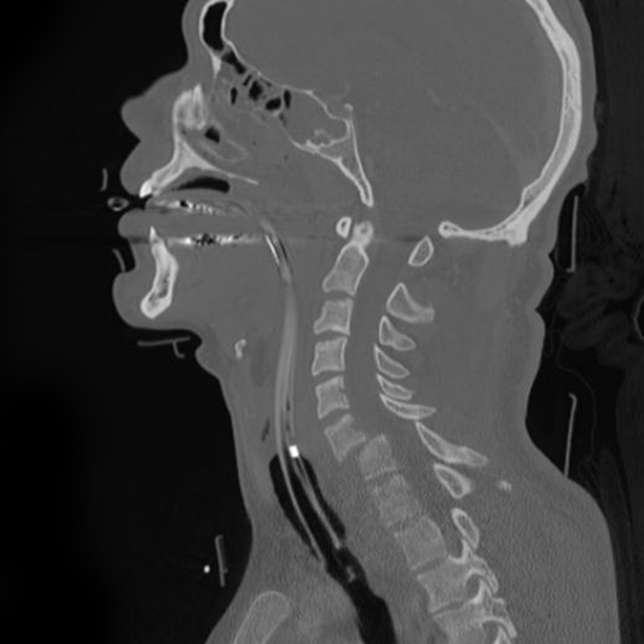

# Facet Dislocations

## Definition

Facet dislocations are traumatic injuries of the cervical spine in which one or both inferior articular processes of a vertebra displace anterior to the superior articular processes of the vertebra below. They represent a spectrum from facet subluxation to unilateral facet dislocation to bilateral facet dislocation, with increasing severity, instability, and risk of neurological injury.

## Classification

### Unilateral Facet Dislocation
- One facet joint is dislocated; the contralateral side is intact or subluxed
- Mechanism: flexion with rotation
- Anterior translation of the vertebral body is typically **≤25%** of the AP diameter
- May present with nerve root injury (radiculopathy) on the side of the dislocation
- The dislocated facet may be "perched" (resting on the tip of the inferior articular process) or "locked" (completely anterior to the inferior articular process)

### Bilateral Facet Dislocation
- Both facet joints are dislocated
- Mechanism: hyperflexion with distraction
- Anterior translation is typically **>50%** of the AP diameter
- Strong association with spinal cord injury — this is one of the most devastating cervical spine injuries
- Complete disruption of the posterior ligamentous complex, disc, and often the posterior longitudinal ligament

## Imaging Findings

### Radiography
- **Lateral view** — Anterior translation of the vertebral body above the dislocation. The "bow-tie" or "double facet" sign may be visible at the level of dislocation. Bilateral facet dislocation shows >50% anterior listhesis; unilateral shows ≤25%.
- Disruption of the normal shingling pattern of the facet joints

### CT
CT with sagittal and coronal reformats provides definitive characterization:

- **Sagittal images** — The "naked facet" sign (empty facet joint), reversed facet alignment, perched or locked facet
- **Axial images** — The "reverse hamburger bun" sign — the superior articular facet of the lower vertebra lies posterior to the inferior articular facet of the upper vertebra (reversed from normal)
- Associated fractures of the articular processes, lateral masses, or laminae
- Canal compromise and retropulsed disc or bone fragments

<figure markdown="span">
  { width="500" }
  <figcaption>CT image demonstrating a cervical facet dislocation at C6–C7 with anterior translation of the superior vertebral body. (Source: Wikimedia Commons, CC BY-SA)</figcaption>
</figure>

### MRI
MRI is critical before reduction is attempted:

- Evaluates for traumatic disc herniation (present in up to 50% of facet dislocations) — a herniated disc may compress the cord during reduction
- Spinal cord edema or hemorrhage
- Posterior ligamentous complex disruption
- Epidural hematoma

!!! tip "Clinical Pearl"
    Before closed reduction of a facet dislocation (via traction), many institutions obtain an MRI to rule out a large disc herniation that could compress the cord during the reduction maneuver. If a significant disc herniation is present, anterior discectomy is typically performed first, followed by reduction and stabilization.

## Associated Injuries

- Traumatic disc herniation (up to 50%)
- Vertebral artery injury (particularly with unilateral dislocations — CT angiography recommended)
- Spinal cord injury (common with bilateral dislocations)
- Facet fractures

## Management

- **Unilateral facet dislocation** — May be treated with closed reduction under traction if no disc herniation on MRI, followed by surgical stabilization. Some can be managed conservatively if the facet is reduced and the patient has no neurological deficit.
- **Bilateral facet dislocation** — Surgical emergency. Requires urgent reduction (closed or open) and surgical stabilization. Anterior, posterior, or combined approaches depending on the specific injury pattern and associated disc herniation.

## Key Points

- Bilateral facet dislocation shows >50% anterior translation and has a high rate of cord injury
- Unilateral facet dislocation shows ≤25% translation and may cause ipsilateral radiculopathy
- CT demonstrates the "naked facet" and "reverse hamburger bun" signs
- MRI before reduction is essential to evaluate for disc herniation that could cause cord injury during reduction
- CT angiography should be obtained for unilateral dislocations to evaluate the vertebral arteries
- Both types are unstable and typically require surgical stabilization

## Related Articles

- [Subaxial Cervical Fractures](subaxial-cervical-fractures.md)
- [Teardrop Fracture](teardrop-fracture.md)
- [SLIC](slic.md)
- [Spinal Cord Injury Imaging](spinal-cord-injury.md)
