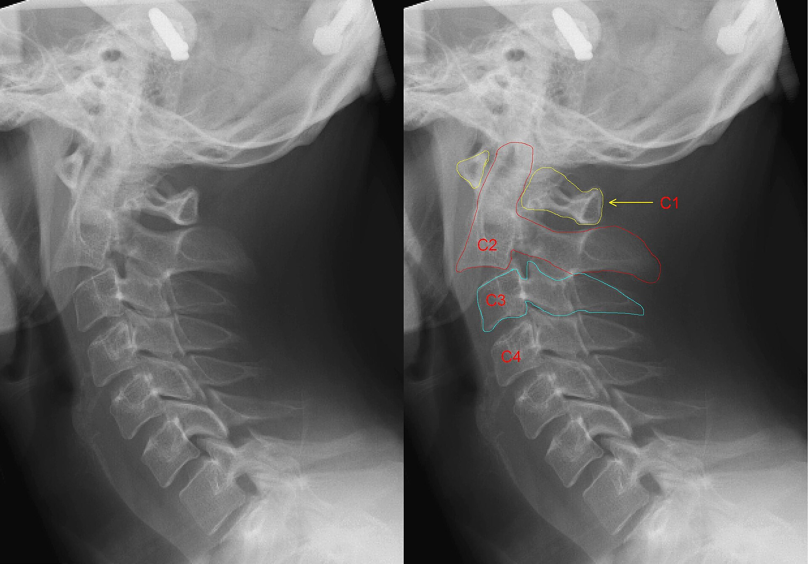
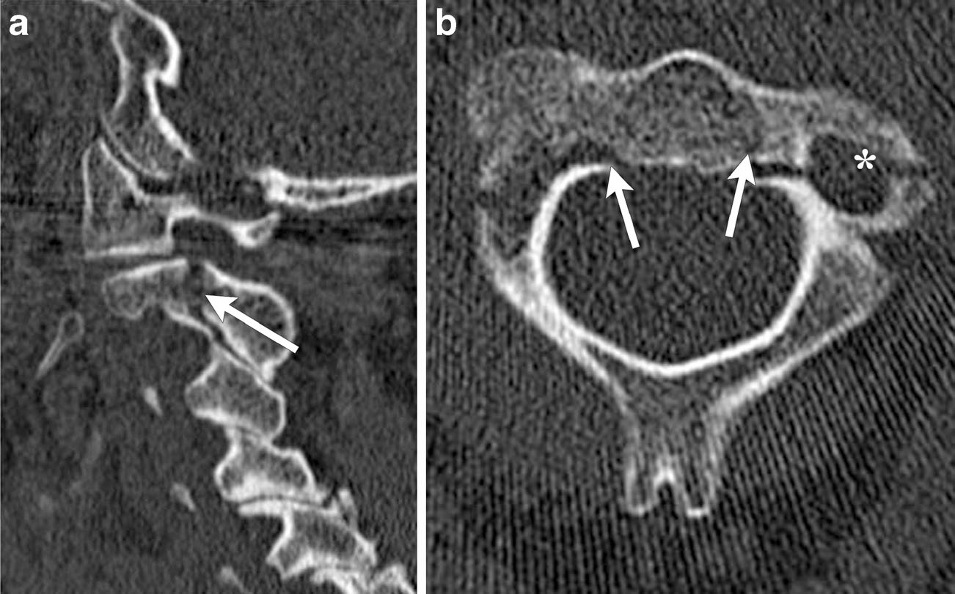

# Hangman Fracture

## Definition

A hangman fracture (traumatic spondylolisthesis of the axis) is a bilateral fracture of the pars interarticularis (isthmus) of C2, with variable displacement of the C2 body relative to C3. Despite its name — coined by Schneider in 1965 after its similarity to injuries from judicial hanging — the modern injury most commonly results from motor vehicle collisions and falls, not from hanging.

## Mechanism of Injury

The typical mechanism is hyperextension with axial compression (as occurs when the face or chin strikes a dashboard or steering wheel). This differs from judicial hanging, which involves hyperextension with distraction. The fracture occurs through the pars interarticularis because the pedicles of C2 are the thinnest and weakest part of the axis ring, further weakened by the transverse foramina.

An important consequence of the bilateral pars fracture is autodecompression of the spinal canal — because the posterior elements separate from the vertebral body, the effective canal diameter increases. This explains why neurological injury is uncommon with hangman fractures despite the apparent severity of the bony injury.

## Classification — Levine and Edwards

**Type I**
Bilateral pars fracture with ≤3 mm subluxation of C2 on C3 and no angulation. The C2–C3 disc and ligaments are intact. This is a stable injury.

**Type II**
Bilateral pars fracture with >3 mm subluxation and significant angulation. The C2–C3 disc is disrupted. This is an unstable injury.

**Type IIA**
Bilateral pars fracture with minimal translation but significant angulation. The mechanism is primarily flexion-distraction rather than extension-compression. The C2–C3 disc is disrupted anteriorly. **Traction is contraindicated** in this subtype because it worsens the distraction.

**Type III**
Bilateral pars fracture with C2–C3 facet dislocation (unilateral or bilateral). This is the most severe and unstable type, with the highest risk of neurological injury.

## Imaging Findings

### Radiography
- **Lateral view** — Fracture lines through the C2 pars interarticularis (may appear as lucencies through the posterior C2 ring), anterior subluxation of C2 on C3, and prevertebral soft tissue swelling
- Displacement and angulation are measured on the lateral view

### CT
CT is definitive for characterizing the fracture:

- Bilateral fracture lines through the pars interarticularis of C2, best seen on sagittal and axial images
- Degree of subluxation of the C2 body on C3
- Angulation at the fracture site
- Associated fractures (C1 anterior arch fractures are common)
- Atypical fracture variants may extend into the posterior body of C2 rather than through the classic pars location

<figure markdown="span">
  { width="500" }
  <figcaption>Lateral radiograph demonstrating a hangman fracture with a fracture line through the pars interarticularis of C2 (arrow) and anterior subluxation of the C2 body on C3. (Source: Wikimedia Commons, CC BY-SA 3.0)</figcaption>
</figure>

<figure markdown="span">
  { width="500" }
  <figcaption>Sagittal CT demonstrating a hangman fracture (traumatic spondylolisthesis of C2) with a fracture through the pars interarticularis and anterior subluxation of the C2 body on C3. (Source: Wikimedia Commons, CC BY-SA)</figcaption>
</figure>

### MRI
- Evaluates C2–C3 disc integrity (key for distinguishing Type I from Type II)
- Assesses spinal cord for compression or edema
- Demonstrates ligamentous injury and prevertebral hemorrhage

!!! tip "Clinical Pearl"
    Atypical hangman fractures — where the fracture line extends through the posterior vertebral body of C2 rather than through the pars — are more dangerous because they do not produce autodecompression of the canal. These variants carry a higher risk of spinal cord injury and may be classified as Levine-Edwards Type IA or as C2 body fractures.

## Associated Injuries

- C1 anterior arch fractures (common)
- Head and facial injuries
- Vertebral artery injury (the vertebral arteries pass through the transverse foramina immediately adjacent to the fracture site)
- Other cervical spine injuries

## Management

- **Type I** — Rigid cervical collar for 8–12 weeks. Excellent prognosis.
- **Type II** — Halo vest immobilization, or surgical fixation (C2–C3 anterior cervical discectomy and fusion) if reduction is inadequate.
- **Type IIA** — Halo vest in slight extension and compression. **Traction is contraindicated.** Surgical fixation may be required.
- **Type III** — Surgical fixation is typically required due to facet dislocation and instability.

## Key Points

- Hangman fracture is a bilateral C2 pars interarticularis fracture, most commonly from hyperextension with axial loading
- Autodecompression of the canal explains the relative infrequency of neurological injury
- Levine-Edwards classification guides management: Type I is stable, Types II/IIA/III are progressively unstable
- Traction is contraindicated in Type IIA injuries
- CT characterizes the fracture; MRI assesses the C2–C3 disc and spinal cord
- CT angiography should be considered to evaluate the vertebral arteries

## Related Articles

- [Odontoid Fractures](odontoid-fractures.md)
- [Jefferson Fracture](jefferson-fracture.md)
- [Subaxial Cervical Fractures](subaxial-cervical-fractures.md)
