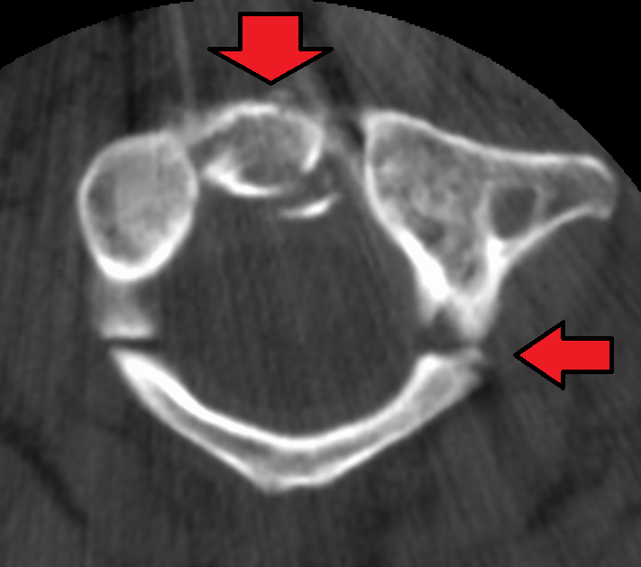

# Jefferson Fracture

## Definition

A Jefferson fracture is a burst fracture of the atlas (C1) ring, classically involving fractures of both the anterior and posterior arches. The injury results from axial loading transmitted through the occipital condyles to the lateral masses of the atlas, causing the ring to spread outward.

## Mechanism of Injury

The mechanism is axial compression — a vertical force applied to the top of the head that is transmitted through the occipital condyles to the C1 lateral masses. Common scenarios include diving into shallow water, motor vehicle collisions (head striking the roof), and falls landing on the vertex of the head.

Because the fracture fragments spread outward (centrifugally), the spinal canal actually widens at the level of the fracture. This explains why isolated Jefferson fractures rarely cause spinal cord injury. However, if the transverse atlantal ligament (TAL) is disrupted, the injury becomes unstable and the risk of neurological compromise increases significantly.

## Classification

The classic Jefferson fracture involves four fracture lines — two in the anterior arch and two in the posterior arch. Variants include two-part and three-part fractures. Atlas fractures are also classified by the Gehweiler system:

- **Type I** — Isolated posterior arch fracture
- **Type II** — Isolated anterior arch fracture
- **Type III** — Combined anterior and posterior arch fractures (classic Jefferson)
- **Type IIIa** — Bilateral
- **Type IIIb** — Unilateral lateral mass with anterior and posterior arch
- **Type IV** — Isolated lateral mass fracture
- **Type V** — Transverse ligament avulsion (with or without bony fragment)

## Imaging Findings

### Radiography
- **Open-mouth (odontoid) view** — Lateral overhang (offset) of the C1 lateral masses beyond the lateral margins of the C2 articular surfaces. The combined bilateral lateral mass overhang is measured — a total exceeding 6.9 mm (the "rule of Spence") suggests transverse ligament disruption, though this threshold has limited reliability.
- **Lateral view** — Prevertebral soft tissue swelling at the C1–C2 level; the anterior atlanto-dental interval (ADI) may be widened if the transverse ligament is disrupted (normal ADI ≤3 mm in adults).

### CT
CT is the definitive modality for characterizing the fracture:

- Fracture lines through the anterior and/or posterior arches of C1
- Lateral mass displacement and degree of offset
- Associated C2 fractures (present in up to 50% of cases)
- Integrity of the bony attachment of the transverse ligament on the medial aspect of the lateral masses

### MRI
MRI is essential for evaluating transverse ligament integrity:

- Intact transverse ligament appears as a low-signal band on axial T2 images
- Ligament rupture shows discontinuity, high T2 signal, or edema at the insertion sites
- Also evaluates for spinal cord compression and associated ligamentous injuries

<figure markdown="span">
  { width="500" }
  <figcaption>Axial CT image demonstrating a Jefferson burst fracture of C1 with fractures of both the anterior and posterior arches and lateral displacement of the lateral masses. (Source: Wikimedia Commons, CC BY-SA 3.0)</figcaption>
</figure>

!!! tip "Clinical Pearl"
    The "rule of Spence" (combined lateral mass overhang >6.9 mm suggests transverse ligament rupture) was derived from cadaveric studies and has limited clinical reliability. MRI is now the standard for assessing transverse ligament integrity, which is the primary determinant of stability and management in Jefferson fractures.

## Stability Assessment

The key question in Jefferson fractures is whether the **transverse atlantal ligament** is intact:

- **TAL intact** — Stable injury; treat conservatively with rigid cervical collar
- **TAL disrupted** — Unstable injury; requires halo vest or surgical fixation (C1–C2 fusion)

## Associated Injuries

- C2 fractures (odontoid or hangman fractures) — present in up to 50% of cases
- Vertebral artery injury
- Other cervical spine fractures
- Head injury

## Key Points

- Jefferson fracture is a burst fracture of the C1 ring caused by axial compression
- The spinal canal widens, so isolated Jefferson fractures rarely cause cord injury
- Transverse ligament integrity determines stability — MRI is essential for this assessment
- The combined lateral mass overhang on open-mouth view is a screening tool but not definitive
- C2 fractures coexist in up to 50% of cases and must be excluded
- CT is the primary modality for fracture characterization; MRI evaluates ligamentous stability

## Related Articles

- [Odontoid Fractures](odontoid-fractures.md)
- [Hangman Fracture](hangman-fracture.md)
- [Atlanto-Occipital Dissociation](atlanto-occipital-dissociation.md)
- [Atlas (C1)](../anatomy/atlas-axis.md)
