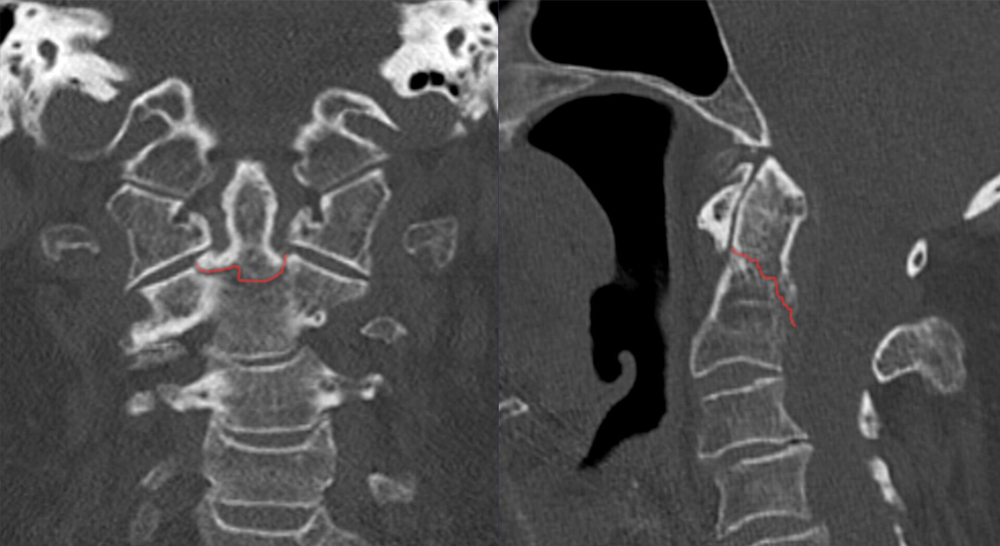
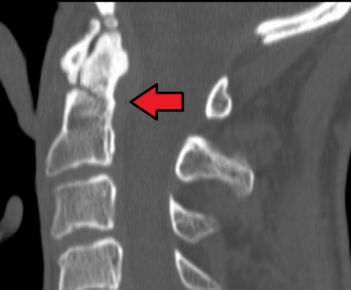
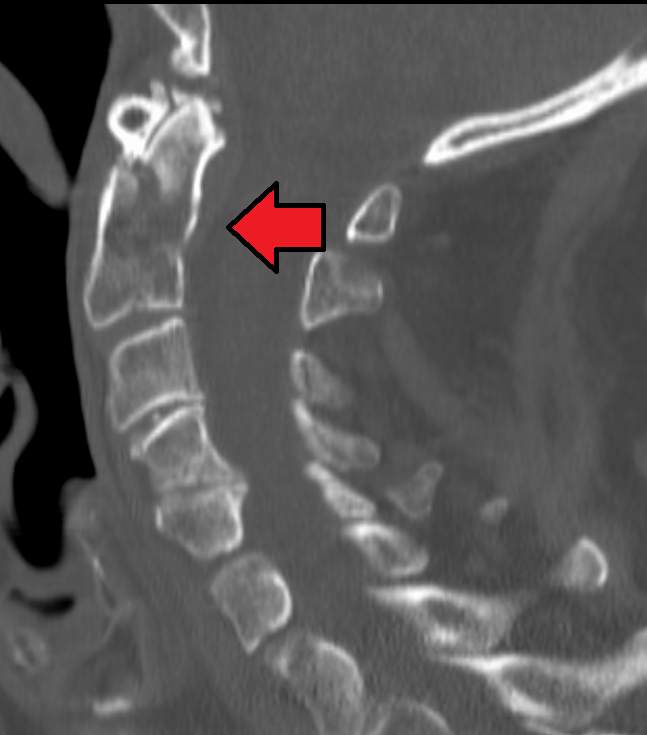

# Odontoid Fractures

## Definition

Odontoid fractures are fractures of the dens (odontoid process) of the axis (C2). They represent the most common fracture type at the C2 level and account for approximately 10–15% of all cervical spine fractures. The proximity of the odontoid process to the spinal cord and brainstem makes these injuries potentially life-threatening.

## Classification — Anderson and D'Alonzo

**Type I — Tip Avulsion**
An oblique fracture through the upper portion of the odontoid tip at the insertion of the alar ligaments. This is the rarest type (<5% of odontoid fractures) and is generally stable unless associated with atlanto-occipital instability.

**Type II — Base of the Dens**
A fracture at the junction of the odontoid process and the C2 vertebral body. This is the most common type (approximately 60–65% of odontoid fractures) and is the most clinically significant because of a high rate of nonunion (25–40%). The limited blood supply at the base of the dens contributes to poor healing.

**Type IIA — Comminuted Base**
A variant of Type II with comminution at the base of the dens, which further increases the risk of nonunion and makes anterior screw fixation technically more difficult.

**Type III — Body of C2**
A fracture extending into the body of the axis, often involving the superior articular facets. This type has a better prognosis and higher union rate than Type II because the fracture extends into the well-vascularized cancellous bone of the C2 body.

## Mechanism of Injury

Odontoid fractures result from hyperextension or hyperflexion forces acting on the upper cervical spine. In younger patients, high-energy trauma (motor vehicle collisions, falls from height) is the typical cause. In elderly patients, low-energy falls are the most common mechanism, and the incidence of odontoid fractures in the elderly has been increasing.

## Imaging Findings

### Radiography
- **Open-mouth (odontoid) view** — May demonstrate a fracture line at the base of the dens; however, overlapping structures and patient positioning can obscure the fracture
- **Lateral view** — May show anterior or posterior displacement of the dens relative to the C2 body

### CT
CT with sagittal and coronal reformats is the definitive imaging study:

- Type I: Fracture through the odontoid tip, usually obliquely oriented
- Type II: Transverse or slightly oblique fracture at the base of the dens, at the junction with the C2 body
- Type III: Fracture line extending into the C2 body, often visible on coronal images as involving the superior articular facets
- Displacement and angulation should be measured on sagittal reformats

### MRI
- Evaluates spinal cord compression or injury
- Demonstrates bone marrow edema (useful for distinguishing acute from chronic fractures and from os odontoideum)
- Assesses the transverse ligament and other stabilizing ligaments
- STIR sequences show acute edema at the fracture site

!!! tip "Clinical Pearl"
    Os odontoideum — a well-corticated ossicle separated from the dens by a smooth gap — must be distinguished from an acute Type II odontoid fracture. Os odontoideum has smooth, sclerotic margins and lacks surrounding edema on MRI. An acute fracture has irregular margins and shows bone marrow edema on STIR. Os odontoideum may itself cause atlantoaxial instability and requires clinical evaluation.

<figure markdown="span">
  { width="500" }
  <figcaption>Coronal and sagittal CT reformats demonstrating a Type II odontoid fracture at the base of the dens (Anderson and D'Alonzo classification). (Source: Wikimedia Commons, CC BY-SA)</figcaption>
</figure>

<figure markdown="span">
  { width="400" }
  <figcaption>Sagittal CT showing a Type II dens fracture with the fracture line at the base of the odontoid process (red arrow). (Source: Wikimedia Commons, CC BY-SA)</figcaption>
</figure>

<figure markdown="span">
  { width="400" }
  <figcaption>Sagittal CT demonstrating a Type III odontoid fracture extending into the body of C2 (red arrows). (Source: Wikimedia Commons, CC BY-SA)</figcaption>
</figure>

## Risk Factors for Nonunion (Type II)

- Age >50 years
- Displacement >5 mm
- Posterior displacement (worse than anterior)
- Delayed diagnosis and treatment
- Smoking
- Comminution at the fracture base (Type IIA)

## Management

**Type I** — Rigid cervical collar for 6–8 weeks if isolated. If associated with craniocervical instability, surgical fixation is required.

**Type II** — Management depends on patient age, displacement, and angulation:

- Minimally displaced fractures in younger patients may be treated with halo vest immobilization
- Displaced fractures (>5 mm), posterior displacement, or elderly patients typically require surgical fixation
- Surgical options include anterior odontoid screw fixation (preserves C1–C2 rotation) or posterior C1–C2 fusion

**Type III** — Generally treated with rigid cervical collar or halo vest immobilization. High union rates with conservative management. Surgery is reserved for significantly displaced or angulated fractures.

## Key Points

- Anderson and D'Alonzo Type II is the most common and most problematic odontoid fracture due to high nonunion rates
- CT with multiplanar reformats is essential for diagnosis and classification
- Type II fractures with displacement >5 mm typically require surgical fixation
- MRI distinguishes acute fractures from os odontoideum and evaluates cord compression
- Type III fractures have a better prognosis and usually heal with conservative management
- Elderly patients with Type II fractures are increasingly common and have higher surgical risk but also higher nonunion rates with conservative treatment

## References

1. Gaillard F, et al. Anderson and D'Alonzo classification of odontoid process fracture. Radiopaedia.org. <https://radiopaedia.org/articles/anderson-and-dalonzo-classification-of-odontoid-process-fracture>
2. Munakomi S, Varacallo M. Odontoid Fractures. StatPearls. NCBI Bookshelf. <https://www.ncbi.nlm.nih.gov/books/NBK441956/>
3. Hadley MN, Browner CM, Liu SS, Sonntag VK. New subtype of acute odontoid fractures (type IIA). Neurosurgery. 1988;22(1):67-71. <https://pubmed.ncbi.nlm.nih.gov/3344089/>
4. Robinson Y, Robinson AL, Olerud C. Systematic Review on Surgical and Nonsurgical Treatment of Type II Odontoid Fractures in the Elderly. BioMed Res Int. 2014;2014:231948. <https://pmc.ncbi.nlm.nih.gov/articles/PMC3934525/>
5. Pal D, Sell P, Grevitt M. Type II odontoid fractures in the elderly: an evidence-based narrative review of management. Eur Spine J. 2011;20(2):195-204. <https://pmc.ncbi.nlm.nih.gov/articles/PMC3030710/>
6. Smith JS, Kepler CK, Kopjar B, Harrop JS, Arnold P, Chapman JR, Fehlings MG, Vaccaro AR, Shaffrey CI. Effect of type II odontoid fracture nonunion on outcome among elderly patients treated without surgery: based on the AOSpine North America geriatric odontoid fracture study. Spine (Phila Pa 1976). 2013;38(26):2240-2246. <https://pubmed.ncbi.nlm.nih.gov/24335630/>
7. Avila MJ, et al. Nonoperative versus operative management of type II odontoid fracture in older adults: a systematic review and meta-analysis. J Neurosurg Spine. 2023. <https://pubmed.ncbi.nlm.nih.gov/37877937/>

## Related Articles

- [Jefferson Fracture](jefferson-fracture.md)
- [Hangman Fracture](hangman-fracture.md)
- [Atlas and Axis](../anatomy/atlas-axis.md)
