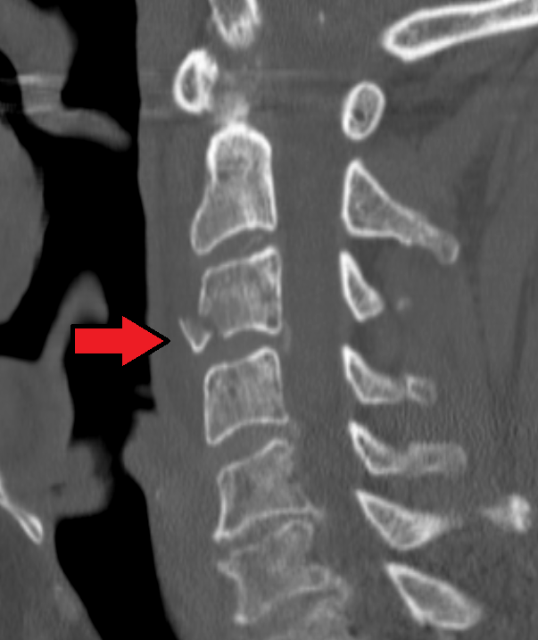

# Teardrop Fracture

## Definition

Teardrop fractures of the cervical spine are characterized by a triangular bone fragment avulsed from the anteroinferior corner of a vertebral body. Despite their similar radiographic appearance, flexion teardrop fractures and extension teardrop fractures have fundamentally different mechanisms, stability profiles, and clinical significance.

## Flexion Teardrop Fracture

### Mechanism
Severe hyperflexion with axial compression — the classic scenario is diving into shallow water or a motor vehicle collision with a direct blow to the vertex of the head.

This is an unstable fracture and one of the most devastating cervical spine injuries. The axial-flexion force causes:

- A triangular fragment to shear from the anteroinferior vertebral body
- Comminution of the vertebral body with retropulsion of the posterior body into the spinal canal
- Complete disruption of the posterior ligamentous complex, disc, and usually the posterior longitudinal ligament
- The posterior vertebral body fragment compresses the anterior spinal cord

### Imaging Findings

**CT:**

- Triangular fragment from the anteroinferior vertebral body
- Sagittal vertebral body fracture (a key distinguishing feature) — the body is split in the sagittal plane
- Retropulsion of the posterior vertebral body into the canal
- Widening of the facet joints and interspinous distance posteriorly
- Kyphotic angulation at the fracture level

**MRI:**

- Spinal cord compression and edema/hemorrhage
- Posterior ligamentous complex disruption
- Disc disruption
- Epidural hematoma

### Clinical Significance
Flexion teardrop fractures are strongly associated with **anterior cord syndrome** — loss of motor function and pain/temperature sensation below the level of injury, with preservation of posterior column function (proprioception, vibration, deep pressure). This occurs because the retropulsed bone fragment damages the anterior two-thirds of the spinal cord.

!!! tip "Clinical Pearl"
    The sagittal vertebral body fracture is a critical distinguishing feature of the flexion teardrop fracture. If you see a triangular anteroinferior fragment AND a sagittal body fracture on coronal CT AND distraction of the posterior elements, this is a flexion teardrop injury — an unstable, three-column injury — not a benign extension teardrop.

<figure markdown="span">
  { width="500" }
  <figcaption>Sagittal CT demonstrating a flexion teardrop fracture of C3 (arrow) with a triangular fragment from the anteroinferior vertebral body and retropulsion into the spinal canal. (Source: Wikimedia Commons, CC BY-SA)</figcaption>
</figure>

## Extension Teardrop Fracture

### Mechanism
Hyperextension — the anterior longitudinal ligament (ALL) avulses a triangular fragment from the anteroinferior vertebral body as the spine extends.

### Imaging Findings

**CT:**

- Small triangular fragment from the anteroinferior vertebral body (similar location to flexion teardrop)
- **No** sagittal vertebral body fracture
- **No** retropulsion or posterior element disruption
- The fragment's vertical height is typically equal to or greater than its transverse dimension
- Most common at C2

### Clinical Significance
Extension teardrop fractures are generally **stable** injuries. The posterior ligamentous complex is intact, and there is no retropulsion into the canal. They are most common in elderly patients with degenerative spines.

## Distinguishing Flexion from Extension Teardrop

| Feature | Flexion Teardrop | Extension Teardrop |
|---------|------------------|--------------------|
| Mechanism | Hyperflexion + axial load | Hyperextension |
| Stability | Unstable (3-column) | Stable |
| Sagittal body fracture | Present | Absent |
| Retropulsion | Present | Absent |
| Posterior elements | Disrupted | Intact |
| Most common level | C4–C6 | C2 |
| Neurological deficit | Common (anterior cord syndrome) | Rare |
| Management | Surgical | Cervical collar |

## Key Points

- Flexion teardrop fractures are highly unstable three-column injuries with frequent anterior cord syndrome
- Extension teardrop fractures are stable single-column injuries that mimic flexion teardrop on lateral view
- The sagittal vertebral body fracture on coronal CT distinguishes the unstable flexion teardrop from the benign extension teardrop
- Retropulsion of the posterior body into the canal is the hallmark of flexion teardrop injuries
- MRI is essential in flexion teardrop fractures to evaluate cord injury and posterior ligamentous disruption

## References

1. Kim KS, Chen HH, Russell EJ, Rogers LF. Flexion teardrop fracture of the cervical spine: radiographic characteristics. AJR Am J Roentgenol. 1989;152(2):319-326. [https://pubmed.ncbi.nlm.nih.gov/2783508/](https://pubmed.ncbi.nlm.nih.gov/2783508/)
2. Cirillo I, Blanco S, Cabello S, Ricciardi G, Guiroy A, Yurac R. Flexion teardrop fracture of the cervical spine: a narrative review. EFORT Open Rev. 2025;10(10):806-814. [https://pmc.ncbi.nlm.nih.gov/articles/PMC12497533/](https://pmc.ncbi.nlm.nih.gov/articles/PMC12497533/)
3. Flexion teardrop fracture. Radiopaedia. [https://radiopaedia.org/articles/flexion-teardrop-fracture-1](https://radiopaedia.org/articles/flexion-teardrop-fracture-1)
4. Extension teardrop fracture of C2. Radiopaedia. [https://radiopaedia.org/cases/extension-teardrop-fracture-of-c2](https://radiopaedia.org/cases/extension-teardrop-fracture-of-c2)
5. Extension teardrop fracture cervical spine. Orthobullets. [https://www.orthobullets.com/spine/12102/extension-teardrop-fracture-cervical-spine](https://www.orthobullets.com/spine/12102/extension-teardrop-fracture-cervical-spine)
6. Flanders A, Smithuis R. Spine — cervical injury. The Radiology Assistant. 2008. [https://radiologyassistant.nl/neuroradiology/spine/cervical-injury](https://radiologyassistant.nl/neuroradiology/spine/cervical-injury)

## Related Articles

- [Subaxial Cervical Fractures](subaxial-cervical-fractures.md)
- [Facet Dislocations](facet-dislocations.md)
- [Spinal Cord Injury Imaging](spinal-cord-injury.md)
