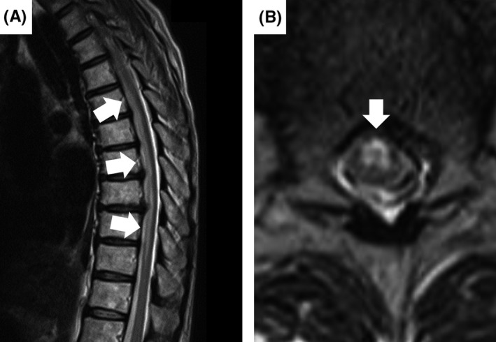

# Anterior Spinal Artery Syndrome

## Definition

Anterior spinal artery syndrome is the clinical manifestation of infarction in the territory of the anterior spinal artery, which supplies the anterior two-thirds of the spinal cord. It produces sudden motor paralysis, loss of pain and temperature sensation, and autonomic dysfunction below the level of the infarct, with characteristic preservation of posterior column function (proprioception, vibration, light touch).

## Clinical Features

- **Motor** — Bilateral motor paralysis below the infarct level (corticospinal tracts)
- **Sensory** — Loss of pain and temperature sensation bilaterally (spinothalamic tracts)
- **Preserved** — Proprioception, vibration, and light touch (dorsal columns, supplied by posterior spinal arteries)
- **Autonomic** — Bladder and bowel dysfunction
- **Onset** — Typically sudden (minutes to hours)

## Imaging Findings

### MRI
- T2 hyperintensity in the **anterior two-thirds** of the cord on axial images
- "Owl eyes" sign — bilateral anterior horn hyperintensity
- Cord expansion in the acute phase
- DWI restricted diffusion
- Posterior columns are spared (normal signal)
- May span multiple vertebral segments, typically in the thoracolumbar watershed zone (T4–T8)

<figure markdown="span">
  { width="500" }
  <figcaption>Anterior spinal cord syndrome. Sagittal T2 showing long-segment cord hyperintensity (A) and axial T2 showing the "owl's eye sign" with bilateral anterior horn involvement (B), characteristic of anterior spinal artery territory infarction. (Source: Harada et al., J Gen Fam Med, 2018. CC BY 4.0)</figcaption>
</figure>

!!! tip "Clinical Pearl"
    Anterior spinal artery syndrome must be distinguished from other causes of acute myelopathy — particularly transverse myelitis and cord compression. The key MRI clue is the **anterior two-thirds distribution** with posterior column sparing. On axial images, this creates a characteristic "pencil-shaped" or crescent-shaped T2 hyperintensity in the anterior cord, distinct from the central cord involvement of transverse myelitis or the dorsal column involvement of B12 deficiency.

## Key Points

- Infarction of the anterior two-thirds of the cord from anterior spinal artery occlusion
- Motor paralysis + loss of pain/temperature with preserved proprioception/vibration
- "Owl eyes" sign on axial T2 MRI
- DWI restricted diffusion is the earliest finding
- Thoracolumbar watershed zone is most vulnerable
- Distinguish from transverse myelitis by the anterior distribution

## Related Articles

- [Spinal Cord Infarction](spinal-cord-infarction.md)
- [Transverse Myelitis](../inflammatory-autoimmune/transverse-myelitis.md)
